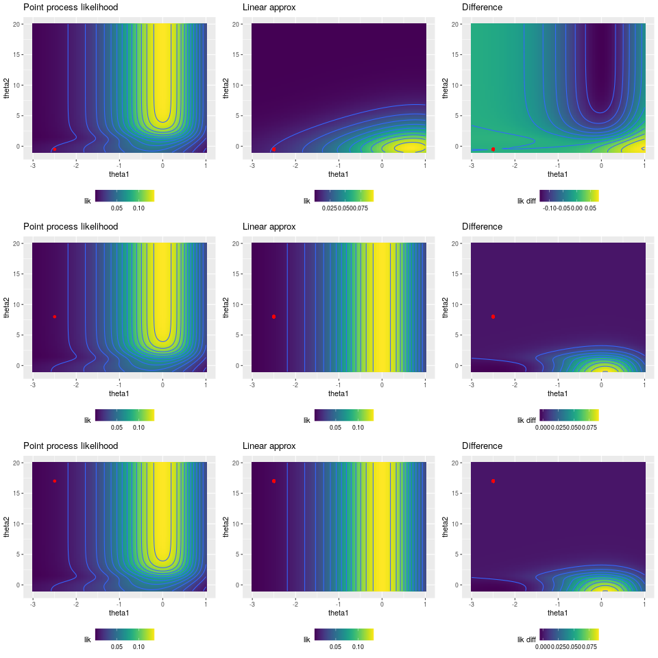
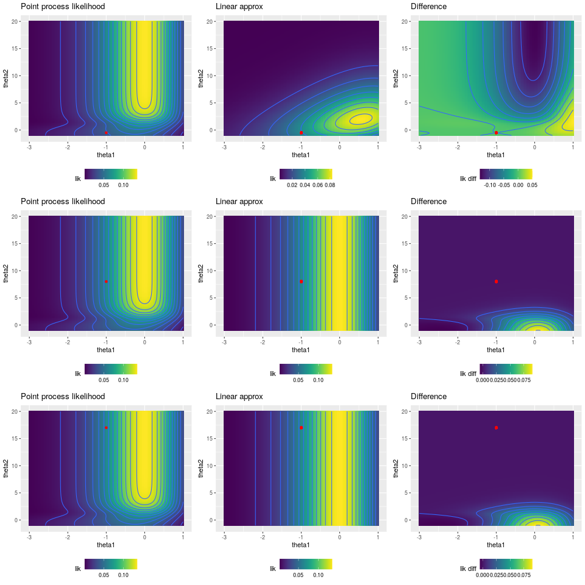
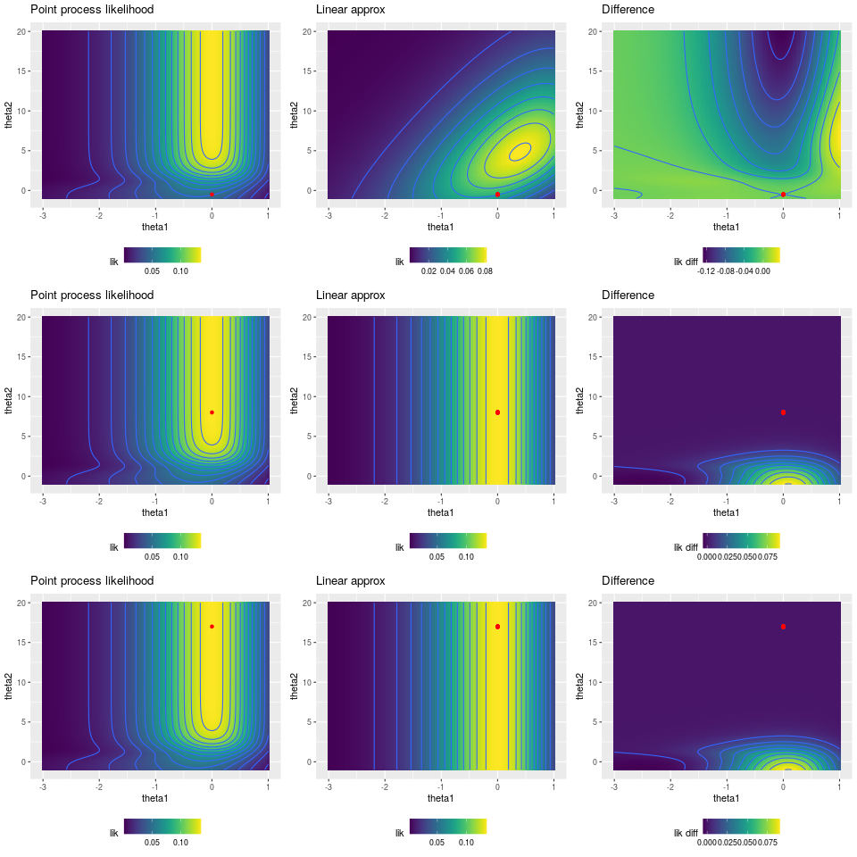
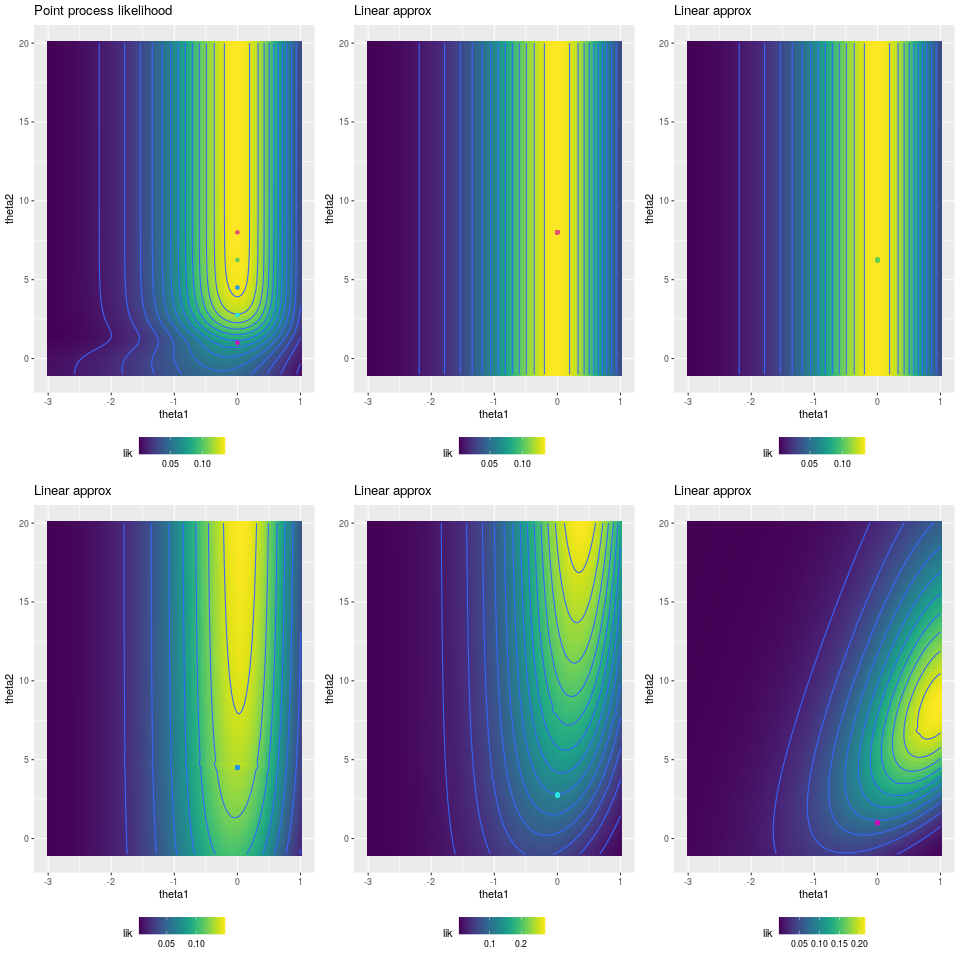
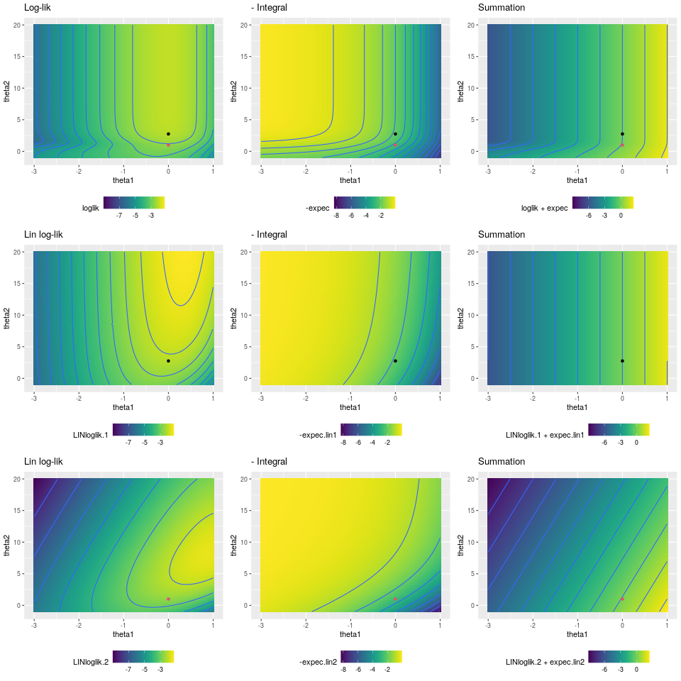
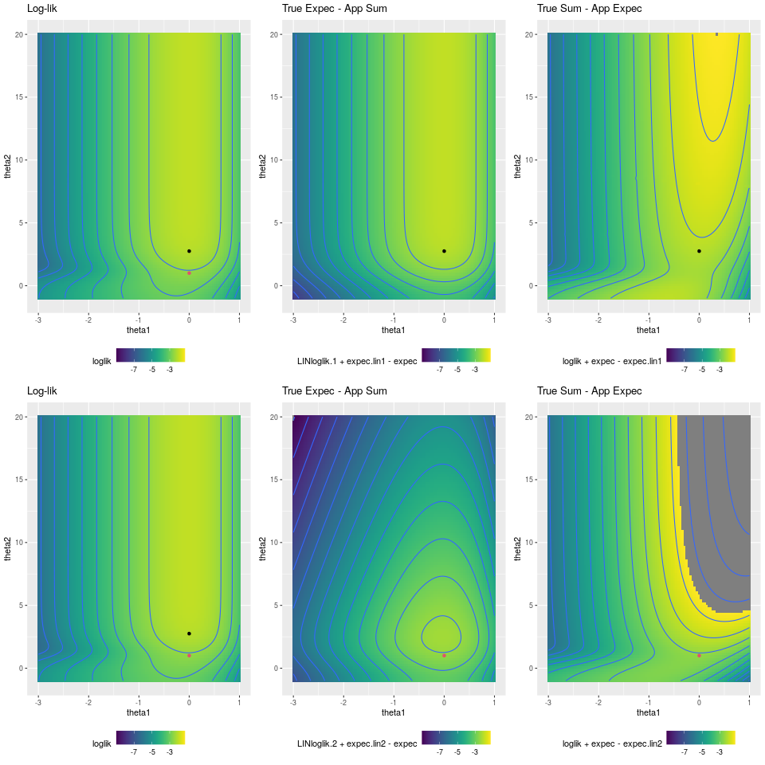
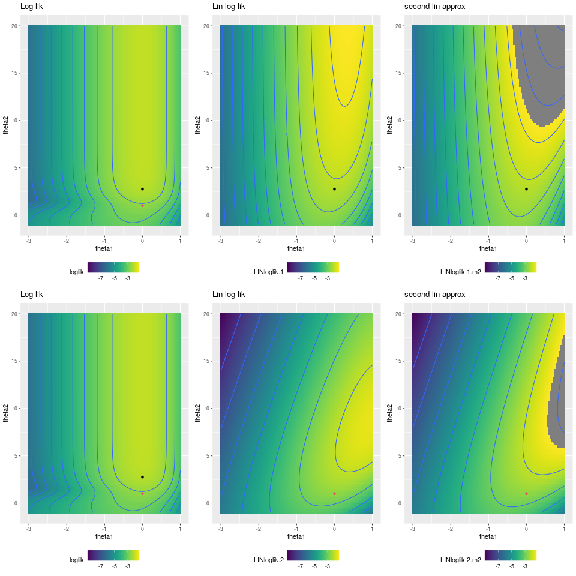
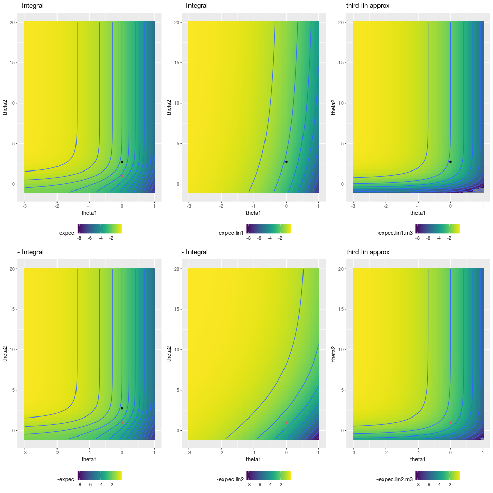
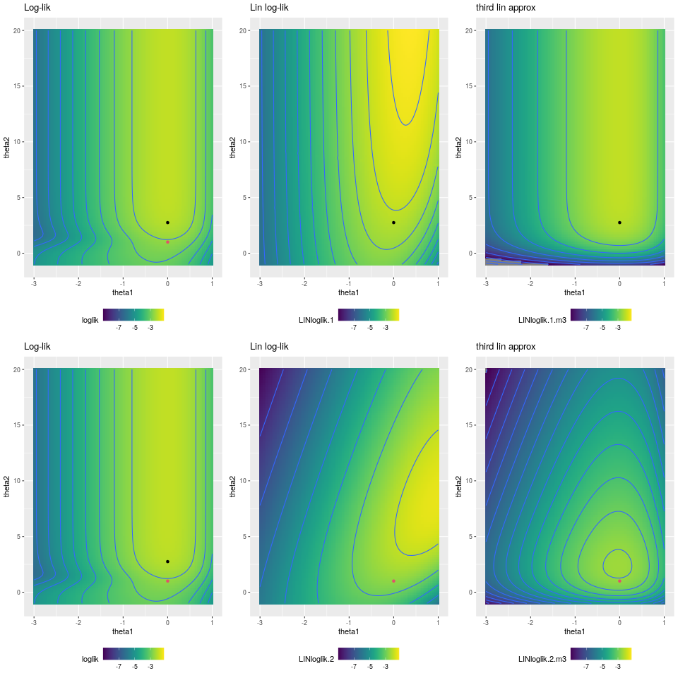
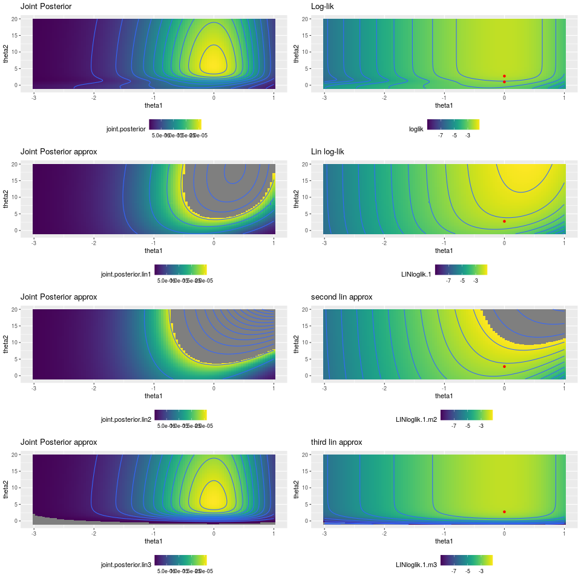

```{r}
knitr::opts_chunk$set(eval = TRUE)
```

# Two ways of representing Point Patterns

Given a set of observations $\{\mathbf y_i: \mathbf y_i \in \mathcal W, i=1,...,n\}$ of a point process in a region $\mathcal W$ we can model this data in two ways: as a point process model or as a poisson counts model. The point process log-likelihood for this data is given by

$$
\mathcal L_{PP} = - \int_{\mathcal W} \lambda(\mathbf s)d\mathbf s + \sum_{i=1}^n \log \lambda(\mathbf y_i)
$$

Where $\lambda(\cdot)$ is the intensity of the point process. The intensity calculated in a point $\mathbf y$ is equal to the limit of ratio between the probability of observing at least one event in a ball around $\mathbf y$ and the volume of this ball. The limit sends the volume of the ball to zero. Here, the data is composed by the actual observations $\mathbf y_1,...,\mathbf y_n$

The second way (Poisson counts) relies on a discretization of the region $\mathcal W$. Suppose that the region $\mathcal W$ is divided in $N$ bins $b_1,...,b_K$ such that $\cup b_k = \mathcal W$ and $b_k \cap b_j = \emptyset$ for any $k \neq j$. For each bin $b_k$, $N_k$ represents the number of observed points in $b_k$. Also, for each bin $b_k$, $\lambda_k$ represents the expected number of points by the model in $b_k$. The log-likelihood for the Poisson counts model is given by

$$
\begin{aligned}
\mathcal L_{PC} & = \sum_{k = 1}^K - \lambda _k + \log(\lambda_k)N_k \\ \\ 
& = - \sum_{k = 1}^K\lambda _k + \sum_{k = 1}^K \log(\lambda_k)N_k
\end{aligned}
$$

We have ignored $N_k!$ because it is a known quantity. Here, the data is composed by the Poisson counts per bin $N_1,...,N_K$.


# What INLA sees

INLA is capable of dealing with Poisson models (as the Poisson counts model) but is not capable of dealing with Point process models directly. Thus, we need to approximate the Point Process likelihood with a Poisson counts likelihood. In other words we need $\mathcal L_{PP} \approx \mathcal L_{PC}$. In order to do that, we need,

$$
\int_{\mathcal W} \lambda(\mathbf s)d\mathbf s \approx  \sum_{k = 1}^K\lambda _k \quad \quad  \sum_{i=1}^n \log \lambda(\mathbf y_i) \approx \sum_{k = 1}^K \log(\lambda_k)N_k
$$

The first bit regards the total number of points expected in the region $\mathcal W$. In fact, the integral of the intensity represents the expected value of the number of points in $\mathcal W$ and the sum of the expected number of points in each bin represents exactly the same thing. The sum of the intensity calculated at the observed points is a measure of "how likely" is to observe the present point patterns while the second summation is a measure of "how likely" is to observe the present counts. 

We can reformulate the Poisson counts model in a way that is more convenient to approximate the Point Process model. Suppose that the intensity, in each bin $b_k$, is contant and equal to $\lambda(\mathbf p_k)$, where $\mathbf p_k$ is the centroid of the bin $b_k$. Suppose, also, that the bin $b_k$ has volume (in 3D, area in 2D, length in 1D) $E_k$. $E_k$ is also know as exposure of the bin $b_k$. In this case, the expected number of points in the bin $b_k$ is given by the product between $\lambda(\mathbf p_k)$ and $E_k$:

$$
\lambda_k = \lambda(\mathbf p_k)E_k
$$

The likelihood of the Poisson Count model in this case becomes

$$
\mathcal L_{PC} = - \sum_{k = 1}^K\lambda(\mathbf p_k)E_k + \sum_{k = 1}^K \log(\lambda(\mathbf p_k))N_k
$$

Where we have ignored the term $\log(E_k)N_k$ in the second summation because known quantity. So, we need that

$$
\int_{\mathcal W} \lambda(\mathbf s)d\mathbf s \approx  \sum_{k = 1}^K\lambda(\mathbf p_k)E_k \quad \quad \sum_{i=1}^n \log \lambda(\mathbf y_i) \approx \sum_{k = 1}^K \log(\lambda(\mathbf p_k))N_k 
$$

Essentially, we are approximating the continuos function $\lambda(\cdot)$ with a piecewise-constant version for which $\forall \mathbf y \in b_k,\, \lambda(\mathbf y) = \lambda(\mathbf p_k)$. The first bit know is just a discrete approximation of the integral. The intensity function $\lambda(\cdot)$ is approximated considering it, in each bin $b_k$, as contant and equal to the value at $\lambda(\mathbf p_k)$. In the second bit, the intensity in a point $\lambda(\mathbf y_i)$ is approximated by $\lambda(\mathbf p_k)$ where $\mathbf p_k$ is the centroid of the bin containing the observation $\mathbf y_i$.

# Approximating the Integral

In order to provide a better approximation of the integral of the intensity is convenient to base the approximation on a tringulation (or mesh) of the region $\mathcal W$. Let's call $\mathbf s_1,...,\mathbf s_J$ the mesh points with weights $w_1,...,w_J$. Then, the integral is approximated by:

$$
\int_{\mathcal W} \lambda(\mathbf s)d\mathbf s \approx  \sum_{j = 1}^J\lambda(\mathbf s_j)w_j
$$
Essentially is like considering a Poisson counts model with $J$ bins defined by the triangulation. Here, $\mathbf s_j$ is the centroid of the bin $b_j$ and $w_j$ is its exposure. The likelihood of such model would be 

$$
\mathcal L_{int} = - \sum_{j = 1}^J\lambda(\mathbf s_j)w_j + \sum_{j = 1}^J \log(\lambda(\mathbf s_j))N_j
$$
Considering $\forall j, \,N_j = 0$ we have that 

$$
\mathcal L_{int} = - \sum_{j = 1}^J\lambda(\mathbf s_j)w_j 
$$

# Approximating the Summation

To approximate the summation is convenient to consider as centroids the observed points $\mathbf y_1,...,\mathbf y_n$. In this way the summation is approximated by:

$$
\sum_{i=1}^n \log \lambda(\mathbf y_i) \approx \sum_{i = 1}^n \log(\lambda(\mathbf y_i))N_i
$$

The associated Poisson counts model log-likelihood is given by:

$$
\mathcal L_{sum} = - \sum_{i = 1}^n\lambda(\mathbf y_i)w_i + \sum_{i = 1}^n \log(\lambda(\mathbf y_i))N_i
$$
Considering $\forall i, \, w_i = 0, N_i = 1$ we have that

$$
\mathcal L_{sum} = \sum_{i = 1}^n \log(\lambda(\mathbf y_i))
$$

# Putting all together
  
  In order to provide a reliable approximation we need to put together the approximation of the integral and the approximation of the summation in a single Poisson counts model. Using the terminology used before, we need to specify a set of centroids $\mathbf p_1,...,\mathbf p_P$ representing the bins, a vector of exposures $E_1,...,E_P$ representing the "size" of the bins and a vector of counts $N_1,...,N_P$ representing the number of observed events in each bin.

The dimension $P$ is given by the sum of the number of mesh points $J$ and the observations $n$, so $P = J + n$. We can use the specifications used in the previous two sections, the three vectors are specified as follows:

$$
\text{centroids} = 
\begin{pmatrix}
\mathbf s_1 \\
\vdots \\
\mathbf s_J \\
\mathbf y_1 \\
\vdots \\
\mathbf y_n
\end{pmatrix}
\quad
\text{exposures} = 
\begin{pmatrix}
w_1 \\
\vdots \\
w_J \\
0 \\
\vdots \\
0
\end{pmatrix}
\quad
\text{counts} = 
\begin{pmatrix}
0 \\
\vdots \\
0 \\
1 \\
\vdots \\
1
\end{pmatrix}
$$

The resulting Poisson counts model has log-likelihood given by 

$$
\begin{aligned}
\mathcal L_{PC} &= \mathcal L_{int} + \mathcal L_{sum} \\ \\ 
&= - \sum_{j=1}^J \lambda(\mathbf s_j)w_j + \sum_{i = 1}^n\log(\lambda(\mathbf y_i)) 
\end{aligned}
$$

Therefore, if $\lambda(\cdot)$ does not require another approximation, the difference between the log-likelihood of the Point Process model and the Poisson counts model depends only on how well we approximate the integral.

## Example

Here, we give a very simple example. We fit a model using the $\texttt{lgcp}$ Inlabru function and we fit the corresponding Poisson model using the $\texttt{bru}$ function. The results will be exactly the same.

For this example, $\mathbf y = (x,y) \in \mathbb R^2$ and $\mathcal W = (0,1)\times(0,1)$. The log-intensity is given by:

$$
\log \lambda(x,y) = \theta(\cos(x) - \sin(y - 1))
$$

The only parameter of the model is $\theta = 4$ and the log-intensity is a linear function of the spatially varying covariate $\cos(x) - \sin(y - 1)$.

```{r, echo = F, message=F,warning=F}
library(ggplot2)
library(inlabru)
library(INLA)
library(viridis)
library(matrixStats)
```


```{r}
# create sequences for plotting 
xx <- seq(0,1,length.out = 100)
yy <- seq(0,1,length.out = 100)
pp <- expand.grid(xx, yy)
# fix theta
theta <- 4
# calculate log-intensity
pp$log.lambda <- theta*(cos(pp[,1]) - sin(pp[,2]-1))
colnames(pp) <- c('x', 'y', 'log.lambda')
# plot
ggplot(pp, aes(x = x, y = y, fill = log.lambda)) + geom_tile() + scale_fill_viridis()
```

The first step is to build a mesh and to generate a sample. We have generated a sample considering containing 345 observations.

```{r}

# create a boundary box to build a mesh 
b.coords <- cbind(c(0, 0, 1, 1, 0),
                  c(0, 1, 1, 0, 0))
poly1 <- Polygon(b.coords)
poly2 <- Polygons(list(poly1), 'a')
bound <- SpatialPolygons(list(poly2))

# build a mesh
mesh = inla.mesh.2d(boundary = bound, max.edge = c(0.05, 0.2))
# calculate the log-intensity at the mesh location
mesh.logl <- theta*(cos(mesh$loc[,1]) - sin(mesh$loc[,2] - 1))
# sample from the corresponding point process model
set.seed(12)
sample1 <- sample.lgcp(mesh, mesh.logl, samplers = bound)
# plot
ggplot(pp, aes(x = x, y = y, fill = log.lambda)) + geom_tile() + 
  geom_point(data = data.frame(sample1@coords),
             mapping = aes(x = x, y = y, fill = NULL)) + 
  scale_fill_viridis()

```

Now that we have our observed sample we can fit the models and check that they produce exactly the same results.

```{r}
# LGCP model
# components is the same for both models 
cmp <- ~ -1 + thetap(1, model = 'linear')

# formula for lgcp
frm.lgcp <- coordinates ~ thetap*(cos(x) - sin(y - 1))

# fit lgcp
fit.lgcp <- lgcp(components = cmp,
                 formula = frm.lgcp,
                 data = sample1,
                 domain = list(coordinates = mesh))

# calculate weights associated with mesh points
ips <- ipoints(domain = mesh)

# build the dataset
data.pois <- data.frame(
  # x,y location (centroids)
  xx = c(mesh$loc[,1], sample1@coords[,1]),
  yy = c(mesh$loc[,2], sample1@coords[,2]),
  # exposures
  exposures = c(ips$weight[,1], rep(0, length(sample1))),
  # observed counts
  obs.c = c(rep(0, mesh$n), rep(1, length(sample1))))

# formula poisson counts model
frm.pois <- obs.c ~ thetap*(cos(xx) - sin(yy - 1))
# poisson fit
fit.pois <- bru(components = cmp,
                formula = frm.pois,
                data = data.pois,
                family = 'poisson',
                options = list(E = data.pois$exposures))
# check the results
rbind(fit.lgcp$summary.fixed, fit.pois$summary.fixed)
```

# Non-linear log-intensity function

We have shown how Inlabru approximate Point Process models using a Poisson counts model. If the log-intensity is a linear function of the parameters, the accuracy of the approximation depends only on how well we approximate the integral of the intensity on the domain (which is the expected number of points). However, what if the function is non-linear? In this case, Inlabru works with the linearized log-intensity. 

Let suppose that $\lambda(\cdot)$ depends on a vector of parameters $\boldsymbol \theta$, in the previous example we had only one parameter. Specifically let suppose that $\log \lambda(\cdot,\boldsymbol \theta)$ is non-linear. Given that Inlabru is able to handle only linear models of the parameters, we need to make the log-intensity linear. This is done taking a value for the parameters $\boldsymbol \theta_0$ and using the first-order Taylor series expansion of the log-intensity. The linearized log-intensity around $\boldsymbol \theta_0$ is given by:

$$
\overline{\log \lambda}(\mathbf y, \boldsymbol \theta) = \log \lambda(\mathbf y, \boldsymbol \theta_0) + \sum_h (\theta_h - \theta_{h,0})\frac{\partial}{\partial\theta_h}\log\lambda \Bigg |_{\boldsymbol \theta = \boldsymbol \theta_0}
$$

This approximation is reliable only around $\boldsymbol \theta_0$. It means that 

$$
\underset{\boldsymbol \theta \rightarrow \boldsymbol \theta_0 }{\lim} \log \lambda - \overline{\log\lambda} = 0 
$$
But it also means that if $\boldsymbol \theta$ is far from $\boldsymbol \theta_0$ the discrepancy may be huge and the results unreliable.

Working with the linearized log-intensity the surrogate Poisson counts model is now:

$$
\mathcal L_{PC} = -\sum_{j=1}^J \exp(\overline{\log \lambda}(\mathbf s_j))w_j + \sum_{i = 1}^n \overline{\log \lambda}(\mathbf y_j)
$$

Before the summation over the observations was calculated exactly, now it is approximated using the lineareized log-intensity. Also the approximation of the integral is different from before. Now, we are approximating numerically the integral of the exponential of the linearized log-intensity, which, in turns, we *hope* approximate the integral of the original intensity.

Basically, now, the source of discrepancy between the Point Process model and the surrogate log-linear Poisson count model are two: the linearization (which accuracy depends on the chosen $\boldsymbol \theta_0$) and the numerical approximation of the integral. The linearization acts on both terms.

# Toy Example

Consider a Temporal Hawkes process model such that having observed $\mathcal H_t = \{t_1,...,t_N\}$ the intensity is given by:

$$
\lambda(t|\mathcal H_t) = \mu + \sum_{i=1}^N g(\alpha, t, t_i)\mathbb I(t_i < t)
$$
Where $g(\alpha, t, t_i)$ is a triggering function governed by the positive parameter $\alpha$ and $\mathbb I(t_i < t)$ is the indicator function that is 1 when $t_i < t$ and zero otherwise. The parameters of the model are $\mu$ (background rate) and $\alpha$ (parameter of the triggering function) and to ensure non-negativity we take 
$\mu = \exp(\theta_1)$ and $\alpha = \exp(\theta_2)$ and take $\boldsymbol \theta = (\theta_1,\theta_2)$ as parameters vector. 

The integral in $[0,T]$ of such intensity is given by:

$$
\begin{aligned}
\int_0^T \lambda(t|\mathcal H_t)dt &= \int_0^T\exp(\theta_1) + \sum_{i=1}^N \int_{t_i}^Tg(\theta_2, t, t_i)dt \\ \\
& = T\exp(\theta_1) + \sum_{i=1}^N I_g(\theta_2,T,t_i)
\end{aligned}
$$
Where the function $I_g(\theta_2,T,t_i)$ is the contribution to the intensity given by the $i$-th observation and it's the integral of the triggering function from the observation $t_i$ to the limit $T$, namely,

$$
I_g(\theta_2, T, t_i) = \int_{t_i}^T g(\theta_2, t, t_i)dt
$$

The log-likelihood for this model is given by:

$$
\begin{aligned}
\mathcal L_{PP} & = - T\exp(\theta_1) - \sum_{i=1}^N I_g(\theta_2,T,t_i) + \sum_{i=1}^N \log(\exp(\theta_1) + \sum_{h:t_h < t_i}g(\theta_2,t_i,t_h)) \\ \\ 
& = \sum_i -\frac{T}{N}\exp(\theta_1) - I_g(\theta_2,T,t_i) + \log(\lambda_i)
\end{aligned}
$$


The intesity is:

$$
\lambda(t|\mathcal H_t) = \exp(\theta_1) + \sum_{h:t_h<t} \exp(-\exp(\theta_2)(t - t_h))
$$

The integral of the intensity on $\mathcal W = [0,T]$ is given by

$$
\begin{aligned}
& \int_0^T \exp(\theta_1) + \sum_{h:t_h<t} \exp(-\exp(\theta_2)(t - t_h))dt = \\ \\ 
& = T\exp(\theta_1) + \sum_{h = 1}^n \int_{t_h}^T\exp(-\exp(\theta_2)(t - t_h))dt = \\ \\ 
& = T\exp(\theta_1) + \sum_{h = 1}^n \frac{\exp(-\exp(\theta_2)(t - t_h))}{-\exp\theta_2} \Bigg |_{t_h}^T = \\ \\
& = T\exp(\theta_1) + \sum_{h = 1}^n \exp(-\theta_2) - \exp(-\exp(\theta_2)(T - t_h))\exp(-\theta_2) = \\ \\ 
& = T\exp(\theta_1) + \sum_{h = 1}^n \exp(-\theta_2)\Big[1 - \exp(-\exp(\theta_2)(T - t_h))\Big]
\end{aligned}
$$


```{r}
pp.lambda.s <- function(t, theta1, theta2, Ht){
  l = exp(theta1)
  for(i in 1:length(Ht)){
    if(t > Ht[i]){
      l = l + exp(-exp(theta2)*(t - Ht[i])) 
    }
  }
  l
}

pp.lambda <- function(tv, theta1, theta2, Ht){
  sapply(tv, function(x) pp.lambda.s(x, theta1, theta2, Ht))
}


# pp.exp <- function(theta1, theta2, Ht){
#   ex <- 2*exp(theta1)
#   for(i in 1:length(Ht)){
#     th <- Ht[i]
#     ex <- ex + exp(-theta2)*(1 - exp(-exp(theta2)*(2 - th)))
#   }
#   ex
# } 
pp.exp <- function(theta1, theta2, Ht, Tlim = 2){
  bk <- log(Tlim) + theta1
  diff <- Tlim - Ht
  trig <- theta2 + log(diff)
  trig <- -exp(trig)
  idx <- (1 - exp(trig) < 1e-15) 
  
  # approximate for small values of 1 - exp(trig)
  trig[idx] <- -theta2 + log(-trig[idx])
  # otherwise use original expression
  trig[!idx] <- -theta2 + log(1 - exp(trig[!idx]))
  
  v <- logSumExp(c(bk, trig))
  exp(v)
} 

pp.loglik.s <- function(theta1, theta2, Ht){
  -pp.exp(theta1, theta2, Ht) + sum(log(pp.lambda(Ht, theta1, theta2, Ht)))
}

pp.loglik <- function(theta1v, theta2v, Ht){
  sapply(1:length(theta1v), function(x) 
    pp.loglik.s(theta1v[x], theta2v[x], Ht))
}

theta1.v <- seq(-3,1,length.out = 100)
theta2.v <- seq(-1,20,length.out = 100)
theta.grid <- expand.grid(theta1 = theta1.v, theta2 = theta2.v)
```


The actual log-likelihood for the Point Process model having observed $H_t = \{t_1,...,t_n: \forall i \quad t_i \in \mathcal [0,T]\}$ is: 

$$
\mathcal L_{PP} = -T\exp(\theta_1) - \sum_{i = 1}^n \exp(-\theta_2)\Big[1 - \exp(-\exp(\theta_2)(T - t_i))\Big] + \sum_{i=1}^n\log(\exp(\theta_1) + \sum_{h:t_h<t_i} \exp(-\exp(\theta_2)(t_i - t_h)))
$$

Let's consider $Ht = \{0.5, 1.5\}$ and $W = [0,2]$. Below, the likelihood and the expected number of points are depicted.

```{r}
ht = c(0.5, 1.5)
theta.grid$loglik <- pp.loglik(theta.grid[,1],theta.grid[,2],ht)
theta.grid$expec <- sapply(1:nrow(theta.grid),
                           function(x) 
                             pp.exp(theta.grid[x,1],theta.grid[x,2],ht))

pl.lik <- ggplot(theta.grid, aes(x = theta1, y = theta2, z = exp(loglik),
                       fill = exp(loglik))) + 
  geom_tile() + scale_fill_viridis() + 
  geom_contour() + 
  theme(legend.position = 'bottom') + 
  labs(title = 'Point process likelihood')

pl.exp <- ggplot(theta.grid, aes(x = theta1, y = theta2, z = expec,
                       fill = expec)) + 
  geom_tile() + scale_fill_viridis() + 
  geom_contour() + 
  theme(legend.position = 'bottom') + 
  labs(title = 'Expected # points')

multiplot(pl.lik, pl.exp, cols =2)
```

This likelihood presents a huge plateau, this means that it is harder to identify a unique maximum likelihood and the results may depends on the algorithm used to optimize the likelihood. Below, we can see the ML estimates of $\theta_1$ and $\theta_2$ using different optimizations methods all provided by the function $\texttt{optim}$. All the combinations of parameters, however, provide a similar expected number of points 

```{r}
loglik.opt <- function(pars, Ht){
  theta1 = pars[1]
  theta2 = pars[2]
  -pp.loglik(theta1, theta2, Ht)
}

opt.res <- rbind(unlist(optim(c(0,0), loglik.opt, Ht = ht)[c(1,4)]),
                 unlist(optim(c(2,2), loglik.opt, Ht = ht)[c(1,4)]),
                 unlist(optim(c(0,0), loglik.opt, Ht = ht, method = 'CG',
                       control=list(maxit=10000))[c(1,4)]),
                 unlist(optim(c(2,2), loglik.opt, Ht = ht, method = 'CG',
                       control=list(maxit=10000))[c(1,4)]),
                 unlist(optim(c(0,0), loglik.opt, Ht = ht, 
                       method = 'BFGS')[c(1,4)]),
                 unlist(optim(c(2,2), loglik.opt, Ht = ht, 
                              method = 'BFGS')[c(1,4)]),
                 unlist(optim(c(0,0), loglik.opt, Ht = ht, 
                              method = 'SANN')[c(1,4)]),
                 unlist(optim(c(2,2), loglik.opt, Ht = ht, 
                       method = 'SANN')[c(1,4)]))


opt.res <- data.frame(opt.res)
opt.res$method <- rep(c('def', 'CG', 'BFGS', 'SANN'), each = 2) 
opt.res$expec <- pp.exp(opt.res[,1], opt.res[,2], c(0.5, 1.5))
colnames(opt.res)[1:2] <- c('theta1', 'theta2')
opt.res

pl.lik + geom_point(data = opt.res,
                    aes(x = theta1, y = theta2, z = NULL, fill = NULL, 
                        shape = method))
```

To compute the corresponding linearized log-likelihood around $\theta_{1,0}, \theta_{2,0}$ we need to find the derivatives of the log-intensity with respect the parameters $\theta_1, \theta_2$

$$
\frac{\partial}{\partial \theta_1} \log\lambda = \frac{1}{\lambda}\exp(\theta_1)
$$

$$
\frac{\partial}{\partial \theta_2} \log\lambda = \frac{1}{\lambda}\sum_{h: t_h < t}\exp(-\exp(\theta_2)(t-t_h))[-\exp(\theta_2)(t-t_h)]
$$

```{r}
theta1.der <- function(tv, theta1, theta2, Ht){
  lam <- pp.lambda(tv, theta1, theta2, Ht)
  (1/lam)*exp(theta1)
}

theta2.der <- function(tv, theta1, theta2, Ht){
  lam <- pp.lambda(tv, theta1, theta2, Ht)
  summ <- 0
  for(i in 1:length(Ht)){
    th <- Ht[i]
    if(th < tv){
      summ <- summ - exp(theta2 - exp(theta2)*(tv - th))*(tv-th)  
    }
  }
  (1/lam)*summ
}

pp.lin.loglambda.s <- function(t, theta1, theta2, Ht, theta10, theta20){
  #print(theta2.der(t, theta10, theta20, Ht))
  log(pp.lambda.s(t, theta10, theta20, Ht)) + 
    (theta1 - theta10)*theta1.der(t, theta10, theta20, Ht) + 
    (theta2 - theta20)*theta2.der(t, theta10, theta20, Ht)
}


pp.lin.loglambda <- function(tv, theta1, theta2, Ht, theta10, theta20){
  sapply(tv, function(x) pp.lin.loglambda.s(x, theta1, theta2, Ht, theta10, theta20))
}
```


```{r, eval = FALSE, echo = FALSE}
loglam.true <- log(sapply(theta1.v, function(x) pp.lambda.s(0.6,x,1,ht))) 
loglam.app.m2 <- pp.lin.loglambda.s(0.6, theta1.v, 1, ht, -2 , 1)
loglam.app.m1 <- pp.lin.loglambda.s(0.6, theta1.v, 1, ht, -1 , 1)
loglam.app.0 <- pp.lin.loglambda.s(0.6, theta1.v, 1, ht, 0 , 1)

plot(theta1.v, loglam.true, type = 'l', col = 'red')
lines(theta1.v, loglam.app.m2)
lines(theta1.v, loglam.app.m1)
lines(theta1.v, loglam.app.0)


loglam.true <- log(sapply(theta2.v, function(x)
  pp.lambda.s(0.6,-1,x,ht))) 

loglam.app.1 <- sapply(theta2.v, function(x)
  pp.lin.loglambda.s(0.6, -1, x, ht, -1 , theta2.v[10]))

loglam.app.2 <- pp.lin.loglambda.s(0.6, -1, theta2.v, ht, -1 , 2)
loglam.app.4 <- pp.lin.loglambda.s(0.6, -1, theta2.v, ht, -1 , 4)

plot(theta2.v, loglam.true, type = 'l', col = 'red')
lines(theta2.v, loglam.app.1)
lines(theta2.v, loglam.app.2)
lines(theta2.v, loglam.app.4)

```


```{r}
pp.lin.loglik.s <- function(theta1, theta2, Ht, theta10, theta20){
  expec <- integrate(function(x) 
    exp(pp.lin.loglambda(x, theta1, theta2, Ht, theta10, theta20)), 
                          lower = 0, upper = 2)$value
  intens <- sum(pp.lin.loglambda(Ht, theta1, theta2, Ht, theta10, theta20))
  - expec + intens
}

pp.lin.loglik <- function(theta1v, theta2v, Ht, theta10, theta20){
  sapply(1:length(theta1v), function(x) 
    pp.lin.loglik.s(theta1v[x], theta2v[x], Ht, theta10,
                       theta20))
}


```

```{r, eval = FALSE, echo = FALSE}
theta.grid$loglik <- pp.loglik(theta.grid$theta1, 
                               theta.grid$theta2, ht)

pl.approx <- function(theta0, theta.grid, col.name, cl = 'red'){
  theta.grid$app <- pp.lin.loglik(theta.grid$theta1,theta.grid$theta2, ht, 
                       theta0[1], theta0[2])
  
  pl <- ggplot(theta.grid, aes(x = theta1, y = theta2, 
                               z = exp(app), fill = exp(app))) + 
    geom_tile() + scale_fill_viridis() + 
    geom_contour() + 
    geom_point(aes(x = theta0[1], y = theta0[2], z = NULL, 
                 fill = NULL), color = cl) + 
    theme(legend.position = 'bottom') + 
    labs(title = 'Linear approx', fill = 'lik')
  
  pl.d <- ggplot(theta.grid, aes(x = theta1, y = theta2, 
                               z = (exp(app) -
                                      exp(loglik)),
                               fill = (exp(app) -
                                         exp(loglik)))) + 
    geom_tile() + scale_fill_viridis() + 
    geom_contour() + 
    geom_point(aes(x = theta0[1], y = theta0[2], z = NULL, 
                 fill = NULL), color = cl) + 
    theme(legend.position = 'bottom') + 
    labs(title = 'Difference', fill = 'lik diff')
  

  list(plot = pl,
       plot.d = pl.d)
}


theta.0.matrix <- rbind(c(-2.5, -0.5),
                        c(-2.5, 8),
                        c(-2.5, 17),
                        c(-1, -0.5),
                        c(-1, 8),
                        c(-1, 17),
                        c(0, -0.5),
                        c(0, 8),
                        c(0, 17))
col.names <- c('bl', 'ml', 'hl', 'bm', 'mm', 'hm',
               'br', 'mr', 'hr')


pl.lik <- ggplot(theta.grid, aes(x = theta1, y = theta2, z = exp(loglik),
                       fill = exp(loglik))) + 
  geom_tile() + scale_fill_viridis() + 
  geom_contour() + 
  theme(legend.position = 'bottom') + 
  labs(title = 'Point process likelihood', fill = 'lik')


pl.list <- list()
for(i in 1:nrow(theta.0.matrix)){
  app <- pl.approx(theta.0.matrix[i,], theta.grid, col.names[i])
  nn <- length(pl.list)
  df.p <- data.frame(x = theta.0.matrix[i,1], y = theta.0.matrix[i,2])
  pl.list[[nn + 1]] <- pl.lik + geom_point(data = df.p, 
                                           aes(x = x,y = y, z = NULL, fill = NULL),
                                           color = 'red')
  pl.list[[nn + 2]] <- app$plot
  pl.list[[nn + 3]] <- app$plot.d
}

png('plot.linear.approx1.png', width = 480*2, height = 480*2)
multiplot(plotlist = pl.list[1:9], layout = matrix(1:9, 
                                              byrow = T, ncol = 3))
dev.off()

png('plot.linear.approx2.png', width = 480*2, height = 480*2)
multiplot(plotlist = pl.list[10:18], layout = matrix(1:9, 
                                              byrow = T, ncol = 3))
dev.off()

png('plot.linear.approx3.png', width = 480*2, height = 480*2)
multiplot(plotlist = pl.list[19:27], layout = matrix(1:9, 
                                              byrow = T, ncol = 3))
dev.off()
# separate effect of the integral from effect of the summation.
# 
```

```{r, out.width='100%', out.height='100%'}

```

```{r, out.width='100%', out.height='100%'}

```

```{r, out.width='100%', out.height='100%'}

```

The figures above give an hint on how the approximation works. The approximation does not work well in the cases where $\boldsymbol \theta_0$ is at the *bottom* of the region we are considering. That area is the one where the likelihood is curving more than in other areas of the domain, so approximating linearly with respect to these points is problematic because we miss *the curve*. This is illustrated below looking at how the approximation changes moving the approximation point toward a region with more curvature.

```{r, eval = FALSE, echo = FALSE}
theta.0.matrix <- cbind(rep(0,5),
                        seq(8,1,length.out = 5))

pl.list <- list()
pl.list[[1]] <- pl.lik + geom_point(data = data.frame(theta.0.matrix),
                    aes(x = X1, y = X2, z = NULL, fill = NULL), color = 2:6)

for(i in 1:nrow(theta.0.matrix)){
  app <- pl.approx(theta.0.matrix[i,], theta.grid, col.names[i], cl = i+1)
  pl.list[[i + 1]] <- app$plot
}

png('plot.linear.approx.ev.png', width = 480*2, height = 480*2)
multiplot(plotlist = pl.list, layout = matrix(1:6, byrow = T, ncol = 3))
dev.off()
```

```{r, out.width='100%', out.height='75%'}

```


# Analyzing differences

One interesting thing to look at is where the bias comes from. Meaning, what is the influence of approximating the summation and the integral? To anwer that we took two of the previous cases and show the original two components and the approximated ones. We work in the log scale because in this way the log-likelihood of interest is the sum of the components. Also, the integral component resents of two sources of bias: first of all we are approximating the integral numerically, second we are approximating the integral of the linearized log likelihood not the true one. We do not plan to separate this two issues.

Below we can see that, the approximation of the integral is accettable because the expected value is a smooth function of the two parameters. On the other hand, the summation is less smooth, the contour lines create an angle around $\theta_2 = 1$, so when we use $\theta_{2,0} > 1$ we do not catch the changes in the bottom region, while using $\theta_{2,0} < 1$ we do not catch the top region.


```{r, eval = FALSE, echo = FALSE}
theta0.df <- data.frame(rbind(c(0, 2.75),
                        c(0, 1.00)))

ht = c(0.5,1.5)
theta.grid$loglik <- pp.loglik(theta.grid$theta1, theta.grid$theta2, ht)
theta.grid$expec <- sapply(1:nrow(theta.grid), function(x) 
  pp.exp(theta.grid$theta1[x], theta.grid$theta2[x], ht)

# first point linearized log lik and linearized expectations 
theta.grid$LINloglik.1 <- pp.lin.loglik(theta.grid$theta1, theta.grid$theta2, ht,
                                        theta0.df[1,1], theta0.df[1,2])   

theta.grid$expec.lin1 <- sapply(1:nrow(theta.grid), function(i)
  integrate(function(x) 
    exp(pp.lin.loglambda(x, theta.grid$theta1[i], theta.grid$theta2[i], ht, 
                         theta0.df[1,1], theta0.df[1,2])), 
                          lower = 0, upper = 2)$value)

# second point
theta.grid$LINloglik.2 <- pp.lin.loglik(theta.grid$theta1,theta.grid$theta2, ht, 
                       theta0.df[2,1], theta0.df[2,2])   

theta.grid$expec.lin2 <- sapply(1:nrow(theta.grid), function(i)
  integrate(function(x) 
    exp(pp.lin.loglambda(x, theta.grid$theta1[i], theta.grid$theta2[i], ht, 
                         theta0.df[2,1], theta0.df[2,2])), 
                          lower = 0, upper = 2)$value)
```


```{r, eval = FALSE, echo = FALSE}
lik.lim <- range(theta.grid$loglik, theta.grid$LINloglik.1, theta.grid$LINloglik.2)
exp.lim <- sort(-range(theta.grid$expec, theta.grid$expec.lin1,
                       theta.grid$expec.lin2))
sum.lim <- sort(range(theta.grid$loglik + theta.grid$expec,
                      theta.grid$LINloglik.1 + theta.grid$expec.lin1,
                      theta.grid$LINloglik.2 + theta.grid$expec.lin2))

# true plot
pl.loglik <- ggplot(theta.grid, aes(x = theta1, y = theta2, 
                                    z = loglik, fill = loglik)) + 
  geom_tile() + geom_contour() + 
  geom_point(data = theta0.df,
             aes(x = X1, y = X2, z = NULL, fill = NULL), color = 1:2) + 
  scale_fill_viridis(limits = lik.lim) + 
  labs(title = 'Log-lik') + 
  theme(legend.position = 'bottom')


pl.int <- ggplot(theta.grid, aes(x = theta1, y = theta2, 
                                 z = - expec, fill = - expec)) + 
  geom_tile() +
  geom_contour() + 
  geom_point(data = theta0.df,
             aes(x = X1, y = X2, z = NULL, fill = NULL), color = 1:2) + 
  scale_fill_viridis(limits = exp.lim) + 
  labs(title = '- Integral')+ 
  theme(legend.position = 'bottom')

pl.dif <- ggplot(theta.grid, aes(x = theta1, y = theta2, 
                                 z = loglik + expec, fill = loglik + expec)) + 
  geom_tile() +
  geom_contour() + 
  geom_point(data = theta0.df,
             aes(x = X1, y = X2, z = NULL, fill = NULL), color = 1:2) + 
  scale_fill_viridis(limits = sum.lim) + 
  labs(title = 'Summation')+ 
  theme(legend.position = 'bottom')

# approx 1 plot

pl.LINloglik1 <- ggplot(theta.grid, aes(x = theta1, y = theta2, 
                                 z = LINloglik.1, fill = LINloglik.1)) +
  geom_tile() +
  geom_contour() + 
  geom_point(data = theta0.df[1,],
             aes(x = X1, y = X2, z = NULL, fill = NULL), color = 1) + 
  scale_fill_viridis(limits = lik.lim) + 
  labs(title = 'Lin log-lik')+ 
  theme(legend.position = 'bottom')

pl.LINint1 <- ggplot(theta.grid, aes(x = theta1, y = theta2, 
                                 z = -expec.lin1, fill = -expec.lin1)) + 
  geom_tile() +
  geom_contour() +
  geom_point(data = theta0.df[1,],
             aes(x = X1, y = X2, z = NULL, fill = NULL), color = 1) + 
  scale_fill_viridis(limits = exp.lim) + 
  labs(title = '- Integral')+ 
  theme(legend.position = 'bottom')

pl.LINdif1 <- ggplot(theta.grid, aes(x = theta1, y = theta2, 
                                 z = LINloglik.1 + expec.lin1, 
                                 fill = LINloglik.1 + expec.lin1)) + 
  geom_tile() +
  geom_contour() + 
  geom_point(data = theta0.df[1,],
             aes(x = X1, y = X2, z = NULL, fill = NULL), color = 1) + 
  scale_fill_viridis(limits = sum.lim) + 
  labs(title = 'Summation')+ 
  theme(legend.position = 'bottom')

# approx 2 plot

pl.LINloglik2 <- ggplot(theta.grid, aes(x = theta1, y = theta2, 
                                 z = LINloglik.2, fill = LINloglik.2)) +
  geom_tile() +
  geom_contour() + 
  geom_point(data = theta0.df[2,],
             aes(x = X1, y = X2, z = NULL, fill = NULL), color = 2) + 
  scale_fill_viridis(limits = lik.lim) + 
  labs(title = 'Lin log-lik')+ 
  theme(legend.position = 'bottom')

pl.LINint2 <- ggplot(theta.grid, aes(x = theta1, y = theta2, 
                                 z = -expec.lin2, fill = -expec.lin2)) + 
  geom_tile() +
  geom_contour() + 
  geom_point(data = theta0.df[2,],
             aes(x = X1, y = X2, z = NULL, fill = NULL), color = 2) + 
  scale_fill_viridis(limits = exp.lim) + 
  labs(title = '- Integral')+ 
  theme(legend.position = 'bottom')

pl.LINdif2 <- ggplot(theta.grid, aes(x = theta1, y = theta2, 
                                 z = LINloglik.2 + expec.lin2, 
                                 fill = LINloglik.2 + expec.lin2)) + 
  geom_tile() +
  geom_contour() + 
  geom_point(data = theta0.df[2,],
             aes(x = X1, y = X2, z = NULL, fill = NULL), color = 2) + 
  scale_fill_viridis(limits = sum.lim) + 
  labs(title = 'Summation')+ 
  theme(legend.position = 'bottom')

png('plot.linear.approx.deco.png', width = 480*2, height = 480*2)
multiplot(pl.loglik, pl.int, pl.dif, pl.LINloglik1, pl.LINint1, pl.LINdif1,
          pl.LINloglik2, pl.LINint2, pl.LINdif2, layout = matrix(1:9,byrow = T,
                                                                 ncol = 3))
dev.off()
```

```{r, out.width='100%', out.height='100%'}

```

# What is worst?

To understand which approximated component of the likelihood is more problematic we are going to use the true summation with the approximated integral and the true integral with the approximated summation.

```{r, eval = FALSE, echo = FALSE}
pl.trueexp.appsum1 <- ggplot(theta.grid, aes(x = theta1, y = theta2, 
                                 z = LINloglik.1 + expec.lin1 - expec, 
                                 fill = LINloglik.1 + expec.lin1 - expec)) + 
  geom_tile() +
  geom_contour() + 
  geom_point(data = theta0.df[1,],
             aes(x = X1, y = X2, z = NULL, fill = NULL), color = 1) + 
  scale_fill_viridis(limits = lik.lim) + 
  labs(title = 'True Expec - App Sum') + 
  theme(legend.position = 'bottom')

pl.trueexp.appsum2 <- ggplot(theta.grid, aes(x = theta1, y = theta2, 
                                 z = LINloglik.2 + expec.lin2 - expec, 
                                 fill = LINloglik.2 + expec.lin2 - expec)) + 
  geom_tile() +
  geom_contour() + 
  geom_point(data = theta0.df[2,],
             aes(x = X1, y = X2, z = NULL, fill = NULL), color = 2) + 
  scale_fill_viridis(limits = lik.lim) + 
  labs(title = 'True Expec - App Sum') + 
  theme(legend.position = 'bottom')

pl.truesum.appexp1 <- ggplot(theta.grid, aes(x = theta1, y = theta2, 
                                 z = loglik + expec - expec.lin1, 
                                 fill = loglik + expec - expec.lin1)) + 
  geom_tile() +
  geom_contour() + 
  geom_point(data = theta0.df[1,],
             aes(x = X1, y = X2, z = NULL, fill = NULL), color = 1) + 
  scale_fill_viridis(limits = lik.lim) + 
  labs(title = 'True Sum - App Expec') + 
  theme(legend.position = 'bottom')

pl.truesum.appexp2 <- ggplot(theta.grid, aes(x = theta1, y = theta2, 
                                 z = loglik + expec - expec.lin2, 
                                 fill = loglik + expec - expec.lin2)) + 
  geom_tile() +
  geom_contour() + 
  geom_point(data = theta0.df[2,],
             aes(x = X1, y = X2, z = NULL, fill = NULL), color = 2) +
  scale_fill_viridis(limits = lik.lim) + 
  labs(title = 'True Sum - App Expec') + 
  theme(legend.position = 'bottom')


png('plot.linear.approx.parts.png', width = 480*2, height = 480*2)
multiplot(pl.loglik, pl.trueexp.appsum1, pl.truesum.appexp1, 
          pl.loglik, pl.trueexp.appsum2, pl.truesum.appexp2,
          layout = matrix(1:6, byrow = T, ncol = 3))
dev.off()

```

```{r, out.width='100%', out.height='100%'}

```


# Alternative ways to approximate the integral

From the previous section it seems that the greatest problems come when we do not approximate well the integral, while the approximation is more robust considering an approximation of the summation less accurate. In this section, we try some alternatives to approximate the integral component. Let's recall that:

$$
\mathcal L_{PP}  = \sum_i -\frac{T}{N}\exp(\theta_1) - I_g(\theta_2,T,t_i) + \sum_i \log(\lambda_i)
$$
Where $I_g(\theta_2, T, t_i)$ is the integral of the triggering function with respect to $t$ going from 0 to $T$ having observed $t_i$. We can consider:

$$
f(t_i, \boldsymbol \theta) = \frac{T}{N}\exp(\theta_1) + I_g(\theta_2,T,t_i) 
$$
In this way the log-likelihood of the process is:

$$
\mathcal L_{PP} = - \sum_{i=1}^N f(t_i, \boldsymbol \theta) + \sum_{i=1}^N\log \lambda_i
$$
Let's look at the first summation of the right end side of the equation. We can consider as it comes from its own Poisson Counts model such that, the log-intensity is equal to $\log f(\cdot)$, the exposures are equal 1 and the counts are equal zero.

Recall that INLA will linearize every non-linear expression of the log-intensity. In this case, the log intensity would be equal to $\log f(\cdot)$, the approximated likelihood will be:

$$
\hat{\mathcal L}_{PP} = -\sum_i \exp(\overline{\log f}(t_i,\boldsymbol \theta, \boldsymbol \theta_0)) + \sum_i \overline{\log \lambda}_i
$$
So, in this case, 

$$
\log f = \log \left( \frac{T}{N}\exp(\theta_1) + I_g(\theta_2,T,t_i) \right)
$$
For which:

$$
\frac{\partial}{\partial \theta_1} \log f = \frac{1}{f}\left(\frac{T}{N} \exp(\theta_1)\right)
$$

$$
\frac{\partial}{\partial \theta_2} \log f = \frac{1}{f}\left[-\exp(-\theta_2) + \exp(-\theta_2 - \exp(-\theta_2(T-t_i)))(1 + \exp(\theta_2)(T-t_i))     \right]
$$


# Approximation

Here we look at this new approximation of the integral of the intensity.

```{r}
Ig <- function(ti, theta2, Tt){
  exp(-theta2)*(1 - exp(-exp(theta2)*(Tt - ti)))
}

Ig.der <- function(ti, theta2, Tt){
  -exp(-theta2) - exp(-theta2 - exp(theta2)*(Tt - ti))*(-1 -exp(theta2)*(Tt- ti))
}


f.fun <- function(t, theta1, theta2, Tt, Ht){
  N = length(Ht)
  val = (Tt/N)*exp(theta1) + Ig(t,theta2,Tt) 
  val
}

theta1.derf <- function(t, theta1, theta2, Tt, Ht){
  N = length(Ht)
  val = f.fun(t, theta1, theta2, Tt, Ht)
  (Tt/N)*exp(theta1)/val
}

theta2.derf <- function(t, theta1, theta2, Tt, Ht){
  val = f.fun(t, theta1, theta2, Tt, Ht)
  Ig.der(t, theta2, Tt)/val
}


approx.f <- function(t, theta1, theta2, Tt, Ht, theta10, theta20){
  log(f.fun(t, theta10, theta20, Tt, Ht)) + 
    (theta1 - theta10)*theta1.derf(t, theta10, theta20, Tt, Ht) +
    (theta2 - theta20)*theta2.derf(t, theta10, theta20, Tt, Ht)
}

approx.int <- function(theta1, theta2, Tt, Ht, theta10, theta20){
  vals <- sapply(Ht, function(x) approx.f(x,theta1, theta2, Tt, Ht, 
                                          theta10, theta20 ))
  sum(exp(unlist(vals)))
}


approx.lik <- function(theta1, theta2, Tt, Ht, theta10, theta20){
  a.integ <- approx.int(theta1, theta2, Tt, Ht, theta10, theta20)
  a.sum <- sum(pp.lin.loglambda(Ht, theta1, theta2, Ht, theta10, theta20))
  a.sum - a.integ
}

```


```{r, echo = FALSE, eval = FALSE}

theta0.df <- data.frame(rbind(c(0, 2.75),
                              c(0, 1.00)))
theta.grid$expec.lin1.m2 <- sapply(1:nrow(theta.grid), 
                                   function(i) approx.int(theta.grid$theta1[i],
                                                          theta.grid$theta2[i],
                                                          2, ht, 
                                                          theta0.df$X1[1],
                                                          theta0.df$X2[1]))

theta.grid$expec.lin2.m2 <- sapply(1:nrow(theta.grid), 
                                   function(i) approx.int(theta.grid$theta1[i],
                                                          theta.grid$theta2[i],
                                                          2, ht, 
                                                          theta0.df$X1[2],
                                                          theta0.df$X2[2]))

pl.LINint1.m2 <- ggplot(theta.grid, aes(x = theta1, y = theta2,
                                        z = - expec.lin1.m2, 
                                        fill = - expec.lin1.m2)) + 
  geom_tile() + 
  geom_contour() + 
  scale_fill_viridis(limits = exp.lim) + 
  geom_point(data = theta0.df[1,],
             aes(x = X1, y = X2, z = NULL, fill = NULL), color = 1) + 
  labs(title = 'second lin approx')+ 
  theme(legend.position = 'bottom')

pl.LINint2.m2 <- ggplot(theta.grid, aes(x = theta1, y = theta2,
                                        z = - expec.lin2.m2, 
                                        fill = - expec.lin2.m2)) + 
  geom_tile() + 
  geom_contour() + 
  scale_fill_viridis(limits = exp.lim) + 
  geom_point(data = theta0.df[2,],
             aes(x = X1, y = X2, z = NULL, fill = NULL), color = 2) + 
  labs(title = 'second lin approx')+ 
  theme(legend.position = 'bottom')


png('plot.linear.approx.integral.png', width = 480*2, height = 480*2)
multiplot(pl.int, pl.LINint1, pl.LINint1.m2,
          pl.int, pl.LINint2, pl.LINint2.m2,
          layout = matrix(1:6, byrow = T, ncol = 3))

dev.off()

```

```{r, out.width='100%', out.height='100%'}
knitr::include_graphics('plot.linear.approx.integral.png')
```


```{r, echo = FALSE, eval = FALSE}
theta.grid$LINloglik.1.m2 <- sapply(1:nrow(theta.grid),
                                    function(i) approx.lik(theta.grid$theta1[i],
                                                           theta.grid$theta2[i],
                                                           2, ht, 
                                                           theta0.df$X1[1],
                                                           theta0.df$X2[1]))


theta.grid$LINloglik.2.m2 <- sapply(1:nrow(theta.grid),
                                    function(i) approx.lik(theta.grid$theta1[i],
                                                           theta.grid$theta2[i],
                                                           2, ht, 
                                                           theta0.df$X1[2],
                                                           theta0.df$X2[2]))


pl.LINloglik1.m2 <- ggplot(theta.grid, aes(x = theta1, y = theta2, 
                                           z = LINloglik.1.m2, 
                                           fill = LINloglik.1.m2)) + 
  geom_tile() + 
  geom_contour() + 
  scale_fill_viridis(limits = lik.lim) + 
  geom_point(data = theta0.df[1,],
             aes(x = X1, y = X2, z = NULL, fill = NULL), color = 1) + 
  labs(title = 'second lin approx')+ 
  theme(legend.position = 'bottom')

pl.LINloglik2.m2 <- ggplot(theta.grid, aes(x = theta1, y = theta2, 
                                           z = LINloglik.2.m2, 
                                           fill = LINloglik.2.m2)) + 
  geom_tile() + 
  geom_contour() + 
  scale_fill_viridis(limits = lik.lim) + 
  geom_point(data = theta0.df[2,],
             aes(x = X1, y = X2, z = NULL, fill = NULL), color = 2) + 
  labs(title = 'second lin approx') + 
  theme(legend.position = 'bottom')

png('plot.linear.approx.altern.png', width = 480*2, height = 480*2)
multiplot(pl.loglik, pl.LINloglik1, pl.LINloglik1.m2,
          pl.loglik, pl.LINloglik2, pl.LINloglik2.m2,
          layout = matrix(1:6, byrow = T, ncol = 3))

dev.off()


```

```{r, out.width='100%', out.height='100%'}

```

# Second Alternative

Another alternative may be considering the integral as two different components

$$
\mathcal L_{PP} = -T\exp(\theta_1) - \sum_i I_g(t_i,\theta_2) + \sum_i \log \lambda(t_i)
$$

Which can be seen as the sum of three Poisson Counts models. The first one is the usual one approximating the summation of the log-intensities. The other two are given by

$$
\lambda_1(t) = T\exp(\theta_1) 
$$
Considering only one observation with exposure equal 1 and the count equal 0.

The second is given by:

$$
\lambda_2(t) = I_g(t, \theta_2) 
$$
Considering as many observations as the true ones, exposures equal 1 and counts equal 0.

The approximated log-likelihood is given by:

$$
\hat{\mathcal L}_{PP} = - \lambda_1 - \sum_i\exp(\overline{\log\lambda_2}(t_i)) + \sum_i \overline{\log \lambda}(t_i)
$$

We notice that $\log(\lambda_1)$ is already linear in $\theta_1$ so, there is no need in linearizing it. It is different for $\lambda_2$ for which

$$
\overline{\log\lambda_2}(t, \theta_2) = \log I_g(t,\theta_{2,0}) + (\theta_2 - \theta_{2,0}) \frac{\partial}{\partial\theta_2}\log I_g \Bigg \vert_{\theta_2 = \theta_{2,0}}
$$

```{r}
logIg.der <- function(t, theta2, Tt){
  val <- exp(-exp(theta2)*(Tt - t))
  -1 + val*exp(theta2)*(Tt - t)/(1-val)
}

approx.Ig <- function(t, theta2, Tt, theta20){
  exp(log(Ig(t,theta20, Tt)) + (theta2 - theta20)*logIg.der(t, theta20, Tt))
}

approx.int2 <- function(theta1, theta2, Tt, Ht, theta10, theta20){
  vals <- sapply(Ht, function(x) approx.Ig(x, theta2, Tt, theta20))
  Tt*exp(theta1) + sum(vals)
}


approx.lik2 <- function(theta1, theta2, Tt, Ht, theta10, theta20){
  a.integ <- approx.int2(theta1, theta2, Tt, Ht, theta10, theta20)
  a.sum <- sum(pp.lin.loglambda(Ht, theta1, theta2, Ht, theta10, theta20))
  a.sum - a.integ
}

```

```{r, echo = FALSE, eval = FALSE}
theta.grid$expec.lin1.m3 <- sapply(1:nrow(theta.grid),
                                    function(i) approx.int2(theta.grid$theta1[i],
                                                           theta.grid$theta2[i],
                                                           2, ht, 
                                                           theta0.df$X1[1],
                                                           theta0.df$X2[1]))


theta.grid$expec.lin2.m3 <- sapply(1:nrow(theta.grid),
                                    function(i) approx.int2(theta.grid$theta1[i],
                                                           theta.grid$theta2[i],
                                                           2, ht, 
                                                           theta0.df$X1[2],
                                                           theta0.df$X2[2]))


pl.LINint1.m3 <- ggplot(theta.grid, aes(x = theta1, y = theta2, 
                                           z = -expec.lin1.m3, 
                                           fill = -expec.lin1.m3)) + 
  geom_tile() + 
  geom_contour() + 
  scale_fill_viridis(limits = exp.lim) + 
  geom_point(data = theta0.df[1,],
             aes(x = X1, y = X2, z = NULL, fill = NULL), color = 1) + 
  labs(title = 'third lin approx')+ 
  theme(legend.position = 'bottom')

pl.LINint2.m3 <- ggplot(theta.grid, aes(x = theta1, y = theta2, 
                                           z = -expec.lin2.m3, 
                                           fill = -expec.lin2.m3)) + 
  geom_tile() + 
  geom_contour() + 
  scale_fill_viridis(limits = exp.lim) + 
  geom_point(data = theta0.df[2,],
             aes(x = X1, y = X2, z = NULL, fill = NULL), color = 2) + 
  labs(title = 'third lin approx')+ 
  theme(legend.position = 'bottom')


png('plot.linear.approx.integral2.png', width = 480*2, height = 480*2)
multiplot(pl.int, pl.LINint1, pl.LINint1.m3,
          pl.int, pl.LINint2, pl.LINint2.m3,
          layout = matrix(1:6, byrow = T, ncol = 3))

dev.off()

```

```{r, out.width='100%', out.height='100%'}

```

```{r, echo = FALSE, eval = FALSE}
theta.grid$LINloglik.1.m3 <- sapply(1:nrow(theta.grid),
                                    function(i) approx.lik2(theta.grid$theta1[i],
                                                           theta.grid$theta2[i],
                                                           2, ht, 
                                                           theta0.df$X1[1],
                                                           theta0.df$X2[1]))


theta.grid$LINloglik.2.m3 <- sapply(1:nrow(theta.grid),
                                    function(i) approx.lik2(theta.grid$theta1[i],
                                                           theta.grid$theta2[i],
                                                           2, ht, 
                                                           theta0.df$X1[2],
                                                           theta0.df$X2[2]))


pl.LINloglik1.m3 <- ggplot(theta.grid, aes(x = theta1, y = theta2, 
                                           z = LINloglik.1.m3, 
                                           fill = LINloglik.1.m3)) + 
  geom_tile() + 
  geom_contour() + 
  scale_fill_viridis(limits = lik.lim) + 
  geom_point(data = theta0.df[1,],
             aes(x = X1, y = X2, z = NULL, fill = NULL), color = 1) + 
  labs(title = 'third lin approx')+ 
  theme(legend.position = 'bottom')

pl.LINloglik2.m3 <- ggplot(theta.grid, aes(x = theta1, y = theta2, 
                                           z = LINloglik.2.m3, 
                                           fill = LINloglik.2.m3)) + 
  geom_tile() + 
  geom_contour() + 
  scale_fill_viridis(limits = lik.lim) + 
  geom_point(data = theta0.df[2,],
             aes(x = X1, y = X2, z = NULL, fill = NULL), color = 2) + 
  labs(title = 'third lin approx') + 
  theme(legend.position = 'bottom')

png('plot.linear.approx.altern2.png', width = 480*2, height = 480*2)
multiplot(pl.loglik, pl.LINloglik1, pl.LINloglik1.m3,
          pl.loglik, pl.LINloglik2, pl.LINloglik2.m3,
          layout = matrix(1:6, byrow = T, ncol = 3))

dev.off()


```

```{r, out.width='100%', out.height='100%'}

```

This alternative proves to be better than the previous ones because we exploit the fact that the logarithm of the component of the integral depending on $\theta_1$ is linear and perhaps it does not need to be linearized. Therefore, the bias in the approximation depends only on the approximation of the integral of the triggering function. 

# Adding Priors

Let's see what happens when we add prior distributions for $\theta_1, \theta_2$.
INLA by defualt assumes Gaussian priors of the parameters with large variance.

$$
\theta_i \sim N(0, 1000)
$$
Which in this case are given by:

```{r}
theta.grid$theta1.prior <- dnorm(theta.grid$theta1, 0, sd = sqrt(1000))
theta.grid$theta2.prior <- dnorm(theta.grid$theta2, 0, sd = sqrt(1000))
theta.grid$joint.prior <- theta.grid$theta1.prior*theta.grid$theta2.prior

theta.grid$joint.posterior <-
  exp(theta.grid$loglik)*theta.grid$joint.prior 


pl.prior <- ggplot(theta.grid, aes( x = theta1, y = theta2,
                                    z = joint.prior, 
                                    fill = joint.prior)) + 
  geom_tile() + 
  geom_contour() + 
  scale_fill_viridis() +
  theme(legend.position = 'bottom') + 
  labs(title = 'Joint Prior') 

pl.posterior <- ggplot(theta.grid, aes( x = theta1, y = theta2, 
                                        z = joint.posterior, 
                                        fill = joint.posterior)) + 
  geom_tile() + 
  geom_contour() + 
  scale_fill_viridis() +
  theme(legend.position = 'bottom') + 
  labs(title = 'Joint Posterior') 
  

multiplot(pl.posterior, pl.lik, pl.prior, cols = 3)
```

Let's look at it using the approximated likelihoods:

```{r, echo = FALSE, eval = FALSE}
theta.grid$joint.posterior.lin1 <-
  exp(theta.grid$LINloglik.1)*theta.grid$joint.prior

theta.grid$joint.posterior.lin2 <-
  exp(theta.grid$LINloglik.1.m2)*theta.grid$joint.prior

theta.grid$joint.posterior.lin3 <-
  exp(theta.grid$LINloglik.1.m3)*theta.grid$joint.prior

post.lim <- range(theta.grid$joint.posterior),
                  theta.grid$joint.posterior.lin1,
                  theta.grid$joint.posterior.lin2,
                  theta.grid$joint.posterior.lin3)


pl.posterior <- ggplot(theta.grid, aes( x = theta1, y = theta2, 
                                        z = joint.posterior, 
                                        fill = joint.posterior)) + 
  geom_tile() + 
  geom_contour() + 
  scale_fill_viridis(limits = post.lim) +
  theme(legend.position = 'bottom') + 
  labs(title = 'Joint Posterior') 

pl.posterior.lin1 <- ggplot(theta.grid, aes( x = theta1, y = theta2, 
                                        z = joint.posterior.lin1, 
                                        fill = joint.posterior.lin1)) + 
  geom_tile() + 
  geom_contour() + 
  scale_fill_viridis(limits = post.lim) +
  theme(legend.position = 'bottom') + 
  labs(title = 'Joint Posterior approx') 

pl.posterior.lin2 <- ggplot(theta.grid, aes( x = theta1, y = theta2, 
                                        z = joint.posterior.lin2, 
                                        fill = joint.posterior.lin2)) + 
  geom_tile() + 
  geom_contour() + 
  scale_fill_viridis(limits = post.lim) +
  theme(legend.position = 'bottom') + 
  labs(title = 'Joint Posterior approx') 

pl.posterior.lin3 <- ggplot(theta.grid, aes( x = theta1, y = theta2, 
                                        z = joint.posterior.lin3, 
                                        fill = joint.posterior.lin3)) + 
  geom_tile() + 
  geom_contour() + 
  scale_fill_viridis(limits = post.lim) +
  theme(legend.position = 'bottom') + 
  labs(title = 'Joint Posterior approx') 

png('posterior.comparison.png', width = 480*2, height = 480*2)
multiplot(pl.posterior, pl.loglik,
          pl.posterior.lin1, pl.LINloglik1,
          pl.posterior.lin2, pl.LINloglik1.m2,
          pl.posterior.lin3, pl.LINloglik1.m3, 
          layout = matrix(1:8, byrow = T, ncol=2))
dev.off()
```

```{r, out.width='100%', out.height='100%'}

```

We can start to explore what are the consequences of using a biased approximation method as part of the INLA procedure. INLA approximate the likelihood around the mode of the posterior distribution. This mode is optimized iteratively until a certain stopping criterion is satisfied. 

We can build use a naive method working as follows:

1. Take a value for the parameters $\theta_1^{(1)}, \theta_2^{(1)}$.

2. Approximate the posterior distribution using $\boldsymbol \theta_0 = \theta_1^{(1)}, \theta_2^{(1)}$. 

3. Find the mode $\hat\theta_1, \hat\theta_2$

4. Set $\theta_1^{(2)} =  \hat\theta_1, \theta_2^{(2)} =  \hat\theta_2$

5. Stop when both the relative differences $\left\vert\frac{\theta_i^{(n-1)} - \theta_i^{(n)}}{\theta_i^{(n)}}\right\vert, i = 1,2$ are below a certain threshold.

We expect that using a biased approximation method the algorithm it will be harder to reach convergence and, if reached, the final approximated mode may be biased (compared with the true one). To check this intuition, we will compare the results of this naive method using the three different approximation methods illustrated before and different starting points.  

```{r}
posterior.to.optim <- function(param, Ht){
  theta1 <- param[1]
  theta2 <- param[2]
  lik <- exp(pp.loglik(theta1, theta2, Ht))
  prior <- dnorm(theta1, 0, sd = sqrt(1000))*dnorm(theta2, 0, sd = sqrt(1000))
  -lik*prior
} 


posterior.approx <- function(param, Tt, Ht, theta10, theta20){
  theta1 = param[1]
  theta2 = param[2]
  lik <- exp(pp.lin.loglik(theta1, theta2, Ht, theta10, theta20))
  prior <- dnorm(theta1, 0, sd = sqrt(1000))*dnorm(theta2, 0, sd = sqrt(1000))
  -lik*prior
}

posterior.approx2 <- function(param, Tt, Ht, theta10, theta20){
  theta1 = param[1]
  theta2 = param[2]
  lik <- exp(approx.lik(theta1, theta2, Tt, Ht, theta10, theta20))
  prior <- dnorm(theta1, 0, sd = sqrt(1000))*dnorm(theta2, 0, sd = sqrt(1000))
  -lik*prior
}

posterior.approx3 <- function(param, Tt, Ht, theta10, theta20){
  theta1 = param[1]
  theta2 = param[2]
  lik <- exp(approx.lik2(theta1, theta2, Tt, Ht, theta10, theta20))
  prior <- dnorm(theta1, 0, sd = sqrt(1000))*dnorm(theta2, 0, sd = sqrt(1000))
  -lik*prior
}

# naive iterative approx method.

naive. <- function(thr, theta.init, m.iter, post.FUN){
  theta.est = matrix(NA, ncol = 2, nrow = m.iter+1)
  colnames(theta.est) <- c('theta1', 'theta2')
  theta.est[1,] = theta.init
  iter = 1
  while(iter <= m.iter){
    est = optim(theta.est[iter,], post.FUN, Tt = 2, Ht = ht,
              theta10 = theta.est[iter,1], theta20 = theta.est[iter,2])$par
    
    if(all(abs((theta.est[iter,] - est)/est) < thr)){
      iter = iter + 1
      theta.est[iter,] <- est
      return(theta.est)  
    }
    else{
      iter = iter + 1
      theta.est[iter,] <- est
    }
  }
  theta.est
}
```

First case we consider: $\theta_1^{(1)} = -5, \theta_2^{(1)} = -5$. The approximation methods differs only on how we approximate the integral of the intensity. We consider a maximum of 10 iterations, the algorithm stops when the relative difference between $\theta_i$ posterior modes is less than 0.001. Different pairs of columns represents different starting point (reported as first row). For this case, the true posterior mode is given by:

```{r}
optim(c(-5,5), posterior.to.optim, Ht = ht)$par
optim(c(0,0), posterior.to.optim, Ht = ht)$par
optim(c(2,10), posterior.to.optim, Ht = ht)$par
```


The first approximation method do not converge. It starts jumping between different configurations of the parameters. The algorithm is stucked in a sort of loop. That is really interesting because it happened to me sometimes using INLA and trying to fit a Temporal ETAS model. I think it was before the updated line-search. 

```{r}
# Approximation using mesh and exponential of the linearized log intensity
cbind(naive.(0.001, c(-2,-5), 10, posterior.approx),
      naive.(0.001, c(0,0), 10, posterior.approx),
      naive.(0.001, c(2,10), 10, posterior.approx))
```

Using the second approximation the algorithm converges but the posterior are heavily biased.

```{r}
# Approximation using 2 Poisson counts model 
cbind(naive.(0.001, c(-2,-5), 10, posterior.approx2),
      naive.(0.001, c(0,0), 10, posterior.approx2),
      naive.(0.001, c(2,10), 10, posterior.approx2))
```

The third approximation method, which was the most promising one, is robust to different starting points and converges to a reasonable value.

```{r}
# Approximation using 3 Poisson counts model
cbind(naive.(0.001, c(-2,-5), 10, posterior.approx3),
      naive.(0.001, c(0,0), 10, posterior.approx3),
      naive.(0.001, c(2,10), 10, posterior.approx3))
```


# Using INLA

Here we show that using INLA we observe the same behavior observed using the naive algorithm in the previous section. 

```{r}
# Approximation using linearized log-intensity
pp.l <- function(tt, theta1, theta2, Ht){
  theta1 <- theta1[1]
  theta2 <- theta2[1]
  pp.lambda(tt, theta1, theta2, Ht)
}

dd <- data.frame(tt = ht)
cmp <- tt ~ theta.1(1) + theta.2(1) - 1
frm <- tt ~ log(pp.l(tt, theta.1, theta.2, ht)) 
mesh.t <- inla.mesh.1d(loc = seq(0,2,length.out = 100))

fit <- lgcp(components = cmp,
            formula = frm,
            data = dd,
            domain = list(tt = mesh.t),
            options = list(bru_verbose = 3,
                           bru_max_iter = 20))
```


```{r}
cbind(iteration = 1:20,
  theta1 = fit$bru_iinla$track[fit$bru_iinla$track$effect == 'theta.1', 'mode'],
  theta2 = fit$bru_iinla$track[fit$bru_iinla$track$effect == 'theta.2','mode'])
```


```{r}
# Approximation using 2 Poisson Counts models
dd.s <- data.frame(tt = ht,
                   counts = 1,
                   exposures = 0)

dd.I <- data.frame(tt = ht,
                   counts = 0,
                   exposures = 1)

cmp <- counts ~ -1 + theta.1(1) + theta.2(1)

frm1 <- counts ~ log(exp(theta.1) + Ig(tt, theta.2, 2))
frm2 <- counts ~ log(pp.l(tt, theta.1, theta.2, ht))

lik.I <- like('poisson',
             formula = frm1,
             data = dd.I,
             options = list(E = dd.I$exposures))

lik.s <- like('poisson',
             formula = frm2,
             data = dd.s,
             options = list(E = dd.s$exposures))


fit2 <- bru(components = cmp, 
            lik.I, lik.s, 
            options = list(bru_verbose = 3,
                           bru_max_iter = 20))

```

```{r}
cbind(iteration = 1:20,
  theta1 = fit2$bru_iinla$track[fit$bru_iinla$track$effect == 'theta.1', 'mode'],
  theta2 = fit2$bru_iinla$track[fit$bru_iinla$track$effect == 'theta.2','mode'])
```


```{r}
# Approximation using 3 Poisson counts models
dd.1 <- data.frame(counts = 0, exposures = 1)

cmp <- counts ~ -1 + theta.1(1) + theta.2(1)

frm1 <- counts ~ log(2) + theta.1
frm2 <- counts ~ log(Ig(tt, theta.2, 2))
frm3 <- counts ~ log(pp.l(tt, theta.1, theta.2, ht))

lik.1 <- like('poisson',
             formula = frm1,
             data = dd.1,
             options = list(E = dd.1$exposures))

lik.I <- like('poisson',
             formula = frm2,
             data = dd.I,
             options = list(E = dd.I$exposures))

lik.s <- like('poisson',
             formula = frm3,
             data = dd.s,
             options = list(E = dd.s$exposures))


fit3 <- bru(components = cmp, 
            lik.1, lik.I, lik.s, 
            options = list(bru_verbose = 3))


```


```{r}
cbind(iteration = 1:20,
  theta1 = fit3$bru_iinla$track[fit$bru_iinla$track$effect == 'theta.1', 'mode'],
  theta2 = fit3$bru_iinla$track[fit$bru_iinla$track$effect == 'theta.2','mode'])
```
 

However, it is weird that the value reported above differs from these ones:

```{r}
fit3$summary.fixed
```

# Parameter marginal posteriors

To find the true marginal posterior of $\theta_1$ and $\theta_2$ we first need to calculate the integral of the posterior. The true joint posterior is given by:

$$
\pi(\boldsymbol \theta | \mathcal H_t) = \frac{\exp(\mathcal L_{PP})\pi(\boldsymbol \theta)}{\int_\Theta \exp(\mathcal L_{PP})\pi(\boldsymbol \theta) d\boldsymbol \theta} 
$$
Where $\Theta \subseteq \mathbb R^2$ is the domain of $\boldsymbol \theta$. In this case, we do not have particular restriction on the parameters value and $\Theta = \mathbb R^2$. We can approximate the integral in the denominator numerically, to do that, we first need to find the subset of $\mathbb R^2$ for which $\exp(\mathcal L_{PP})\pi(\boldsymbol \theta) \neq 0$. For this example we have selected $\theta_1 \in (-4, 1.5)$ and $\theta_2 \in (-85, 80)$ for which product of likelihood and prior looks like:

```{r}
theta1.post <- seq(-4,1.5,length.out = 100)
theta2.post <- seq(-85, 80, length.out = 500)
  
theta.grid2 <- data.frame(expand.grid(theta1.post, theta2.post))
colnames(theta.grid2) <- c('theta1', 'theta2')

theta.grid2$post <- sapply(1:nrow(theta.grid2), 
                          function(x) 
                            -posterior.to.optim(as.numeric(theta.grid2[x,1:2]),
                                                          ht))


ggplot(theta.grid2, aes(x = theta1, y = theta2, z = post, fill = post)) + 
  geom_tile() + 
  geom_contour() + 
  scale_fill_viridis() + 
  labs(title = 'product lik prior')

```

The integral can then be approximated considering the space divided in identical bins with centroids $\boldsymbol \theta_i, i = 1,...,n$ and area $w$ and assuming that the integrand is constant in each bin. The approximated integral is given by: 

$$
\int_\Theta \exp(\mathcal L_{PP})\pi(\boldsymbol \theta) d\boldsymbol \theta \approx \sum_i \exp(\mathcal L_{PP}(\boldsymbol \theta_i))\pi(\boldsymbol \theta_i)w
$$

```{r}
w = diff(theta1.post)[1]*diff(theta2.post)[2]
integral = w*sum(theta.grid2$post)
theta.grid2$true.post <- theta.grid2$post/integral

theta.grid2$exp <- sapply(1:nrow(theta.grid2), 
                          function(x) pp.exp(theta.grid2$theta1[x],
                                             theta.grid2$theta2[x],
                                             ht))

pl.tl <- ggplot(theta.grid2, aes(x = theta1, y = theta2, z = true.post, 
                        fill = true.post)) + 
  geom_tile() + 
  geom_contour() + 
  scale_fill_viridis() + 
  labs(title = 'True posterior')

pl.exp <- ggplot(theta.grid2, aes(x = theta1, y = theta2, z = exp, 
                        fill = exp)) + 
  geom_tile() + 
  geom_contour() + 
  scale_fill_viridis() + 
  labs(title = 'Expected number of points')

multiplot(pl.tl, pl.exp, cols = 2)
 

```

Now, to calculate the marginal posterior for $\theta_i$ we have to integrate the posterior for with respect the other parameter. We can use an approximation similar to the one used before. 

$$
\pi(\theta_1|\mathcal H_t) = \int \pi( \theta_1, \theta_2 | \mathcal H_t)d\theta_2
$$

and, considering the domain of $\theta_2$ as divided in equally spaced bins with centroids $\theta_{2,i}$ with length $w$ we can write 

$$
\int \pi(\theta_1,\theta_2 | \mathcal H_t)d\theta_2 \approx \sum_i \pi(\theta_1, \theta_{2,i}|\mathcal H_t) w
$$

```{r}
marg.theta1 <- function(theta1, Ht, integ = integral){
  theta2.i <- seq(-85,80,length.out = 1000)
  wb <- diff(theta2.i)[2]
  app <- cbind(rep(theta1, 1000), theta2.i)
  joint.p <- sapply(1:1000, function(x) -posterior.to.optim(app[x,], Ht))
  sum(joint.p*wb/integ)
}

marg.theta2 <- function(theta2, Ht, integ = integral){
  theta1.i <- seq(-4,1.5,length.out = 1000)
  wb <- diff(theta1.i)[2]
  app <- cbind(theta1.i,rep(theta2, 1000))
  joint.p <- sapply(1:1000, function(x) -posterior.to.optim(app[x,], Ht))
  sum(joint.p*wb/integ)
}

```

```{r}
marg.t1 <- sapply(theta1.post, function(x) marg.theta1(x, ht))
marg.t2 <- sapply(theta2.post, function(x) marg.theta2(x, ht))

df.theta1 <- data.frame(theta1 = theta1.post,
                        marginal = marg.t1/max(marg.t1),
                        approx = 'true')

df.theta2 <- data.frame(theta2 = theta2.post,
                        marginal = marg.t2/max(marg.t2),
                        approx = 'true')

pl.marg.t1 <- ggplot(df.theta1, aes(x = theta1, y = marginal)) + 
  geom_line()

pl.marg.t2 <- ggplot(df.theta2, aes(x = theta2, y = marginal)) + 
  geom_line()

multiplot(pl.marg.t1, pl.marg.t2, cols = 2)
```


```{r}
colnames(df.theta1) <- c('x', 'y', 'approx')
colnames(df.theta2) <- colnames(df.theta1)

# theta1
marg.t1.1 <- data.frame(fit$marginals.fixed$theta.1, 
                        approx = '1')
marg.t1.1$y <- marg.t1.1$y/max(marg.t1.1$y) 
marg.t1.2 <- data.frame(fit2$marginals.fixed$theta.1, 
                        approx = '2')
marg.t1.2$y <-marg.t1.2$y/max(marg.t1.2$y) 
marg.t1.3 <- data.frame(fit3$marginals.fixed$theta.1, 
                        approx = '3')
marg.t1.3$y <- marg.t1.3$y/max(marg.t1.3$y) 

df.theta1 <- rbind(df.theta1, marg.t1.1, marg.t1.2, marg.t1.3)

### theta2

marg.t2.1 <- data.frame(fit$marginals.fixed$theta.2, 
                              approx = '1')
marg.t2.1$y <- marg.t2.1$y/max(marg.t2.1$y) 
marg.t2.2 <- data.frame(fit2$marginals.fixed$theta.2, 
                              approx = '2')
marg.t2.2$y <- marg.t2.2$y/max(marg.t2.2$y)
marg.t2.3 <- data.frame(fit3$marginals.fixed$theta.2, 
                              approx = '3')
marg.t2.3$y <- marg.t2.3$y/max(marg.t2.3$y)

df.theta2 <- rbind(df.theta2,marg.t2.1, marg.t2.2, marg.t2.3)


ggplot(df.theta1, aes(x = x, y = y, color = approx, linetype = approx)) +
   geom_line() + 
  xlim(-4,4)+ 
  labs(title = 'theta1 posterior') + 
  ylab('scaled marginal posterior') + 
  xlab('theta1')


ggplot(df.theta2, aes(x = x, y = y, color = approx, linetype = approx)) +
  geom_line() + 
  xlim(-100,100) + 
  labs(title = 'theta2 posterior') + 
  ylab('scaled marginal posterior') + 
  xlab('theta1')


```

