```{r setup, include=FALSE}
knitr::opts_chunk$set(echo = FALSE, eval = FALSE)
```

## Temporal Hawkes process

We are going to consider a one-dimensional temporal Hawkes process model with intensity given:

$$
\lambda(t)|\mathcal H_t = \mu + K \sum_{i:t_i < t} h(t - t_i, \boldsymbol \theta)
$$

Where the summation is over all events $t_i \in \mathcal H_t$ in the history of the process happend before the evaluation point $t$. The parameters of the model are 
$\mu$ the background rate, $K$ the productivity parameter which regulates the number of maximum offspring that an event may have, and $\boldsymbol \theta$ parameters of the triggering function $h(\cdot, \boldsymbol \theta)$ which regulates the temporal distribution of the offsprings. We are going to consider $\boldsymbol \theta = (c, p)$ such that $c > 0$, and $p > 1$, and

$$
h(t - t_i, c, p) = \frac{(p-1)c^{p-1}}{(t - t_i + c)^p}
$$

This process at time $t$ can be decomposed in the sum of $n = 1 + |\mathcal H_t|$ 
sub-processes $\lambda_j(t), j = 0,...,n-1$, where $\lambda_0(t) = \mu$ is an homogeneous poisson process representing the background, and $n - 1$ inhomogeneous poisson processes with intensity  

$$
\lambda_i(t) = Kh(t - t_i,\boldsymbol \theta)
$$

representing the influence of each observation $t_i$ on the present $t$.

The integral with respect to $t \in (0,T)$ of the intensity gives us the expected number of points in the interval $(0,T)$, in this case, considering $\mathcal H_t = (t_1,...,t_N)$ such that $t_i < T$, it is given by:

$$
\begin{aligned}
\Lambda(T) &= \int_0^T \mu + K\sum_{i:t_i < t} \frac{(p-1)c^{p-1}}{(t - t_i + c)^p}dt \\ \\
&= \mu T + K \sum_{i=1}^N (p-1)c^{p-1} \int_{t_i}^T (t - t_i + c)^{-p}dt \\ \\ 
& = \mu T + K \sum_{i=1}^N (p-1)c^{p-1} \left(\frac{(t - t_i + c)^{1-p}}{1-p} \Bigg |_{t_i}^T \right) \\ \\ 
& = \mu T + K \sum_{i=1}^N c^{p-1} \left(-(t - t_i + c)^{1-p} \Bigg |_{t_i}^T \right) \\ \\ 
& = \mu T + K \sum_{i=1}^N \left(1 - c^{p-1}(T - t_i + c)^{1-p}\right)
\end{aligned}
$$

To continue the decomposition used before, we can rewrite the intergral as

$$
\Lambda(T) = \int_0^T \lambda_0(t) dt + \sum_{i = 1}^N \int_{t_i}^T \lambda_i(t)dt  
$$

Where $\lambda_0(t) = \mu$ is the homogeneous background process, and $\lambda_i(t) = Kh(t-t_i)$ are the processes triggered by each observation $t_i$ in the history of the process. The number of offspring generated by each of these triggered sub-processes is given by:

$$
\begin{aligned}
\Lambda_i &= \int_{t_i}^\infty K h(t-t_i, \boldsymbol \theta)dt \\
&=  K c^{p-1} \left(-(t - t_i + c)^{1-p} \Bigg |_{t_i}^\infty \right) \\ 
&= K
\end{aligned}
$$
Where the last equation is valid only if $p > 1$. So, as we said before, the parameter $K$ regulates the expected number of offsprings generated by an event while the parameters $\boldsymbol \theta = (c, p)$ regulates the decay in time of in the distribution of these offsprings.

To efficiently sample in $(0,T)$ from this model we can use this decomposition, we first generate the background events and for each of the events in the background we generate the respective offsprings, we keep only the offsprings smaller than $T$, we repeat the process for the offsprings of the offsprings until we do not have any event generated in $(0,T)$.

To do that, we need, first of all to generate from $\lambda_i(t)$, we can do that efficiently using inverse sampling. In fact, for any $c > 0$ and $p > 1$

$$
\int_{t_i}^\infty h(t - t_i)dt = 1
$$
So $h(t-t_i)$ can be seen as a density, from which we can calculate the probability that a point is between $t_i, T$, 

$$
F_i(T) = \int_{t_i}^T h(t - t_i)dt = 1 - c^{p-1}(T - t_i + c)^{1-p} 
$$

A technique to extract $n$ samples from $h(t - t_i)$ is called inverse sampling technique and it follows: 

1. sample $n$ elements $u_1,...,u_n$ from $Unif(0,1)$
2. transform the samples $t_i = F_i^{-1}(u)$

The trasnformed $t_1,...,t_n$ represents a sample from $h(t-t_i)$. Here the inverse of the cumulative distribution function is given by:

$$
F_i^{-1}(u) = c(1 - u)^{\frac{1}{1-p}} + t_i - c
$$

Belowe we show a historgram of the events generated by an observations in $t_i = 1$ and considering $c = 0.01$ and $p = 1.5$. Red line represents the value of $h(t-t_i, c, p)$, calculated at $t$ equal to the midpoints of the histograms's bins.

```{r, eval = TRUE}
source("omori_utils.R")
ht = 1
Tlim = 3
t.br <- seq(1, Tlim, by = 0.02)
#t.sa <- sample.omori(10000, c.p = 0.01, pm1 = 0.5, ht, Tlim = Tlim)

t.sa2 <- sample.omori(10000, c.p = 0.01, p.p = 1.5, ht, Tlim = Tlim)
range(t.sa2)
range(t.br)
# 
hh <- hist(t.sa2, breaks = t.br, plot = FALSE)
dd <- trig.T3(hh$mids, 0.01, 0.5, ht)

# check that the sample actually comes from the right point process.
# the trasformed values should come from a unit rate Poisson process
checking <- I.h2(t.sa2, 0.01, 0.5, ht)
hist(checking)

```


Having the ability of sampling the observations generated by a generic evet in the process, we can build an algorithm to sample from the process itself. To obtain a sample in $(0,T)$, supposing that there are no events prior to time 0 and that we have no information about events in $(0,T)$, from an Hawkes process with conditional intesity given by:

$$
\lambda(t)|\mathcal H_t = \mu + K\sum_{i:t_i < t} h(t - t_i, c, p)
$$

it is sufficient to:

1. Sample $N_\mu$ from a Poisson variable with intesity $\mu$ and sample $N_\mu$ points uniformly in $(0,T)$. These points will be our background events

2. For each background event $t_i$, 
     + sample $N_K$ from a Poisson variable with intensity $K$ and sample $N_K$ points from $h(t - t_i, c, p)$. Discard all the events after $T$. The remaining events will be the first generation of offsprings, namely, the events generated by the background events.
     
3. If no event has been generated at step 2., we stop and the sample is constitute by background events solely. If we have generated events at step 2., we repeat step 2. but with the first generation of offsprings in place of the background events. The resulting events will be the second generation of offsprings. 

4. Repeat as long as you have a non-empty generation.

Here an example using $\mu = 10, K = 0.9, c = 0.01, p = 1.5$ in the interval $(0,10)$. First plot shows the histogram of the observations and the intensity of the process, calculated at the midpoints of the histogram's bins, and multiplied by the bin's width. Second plot, for each time $t$, shows the cumulative sum up to time $t$ of the quantities shown in the first plot.

```{r, eval = TRUE, echo = TRUE}
parms <- c(10, 0.5, 0.01, 0.5)
Tlim = 10
ss <- sample.hawkes(parms, Tlim)

toplot.hist.lambda(parms, ss, Tlim)
toplot.hist.lambda(parms, ss, Tlim, cumulative = T)
```

# Likelihood

For point process models, given a set of observations $\mathcal H_t = (t_1,....,t_N)$ in $(0,T)$, the expression of the log-likelihood is given by:

$$
\mathcal L(\boldsymbol \theta, \mathcal H_t) = -\int_0^T \lambda(t)dt + \sum_{i = 1}^N \log\lambda(t_i)
$$
Which in out case is give by (we omit $\mathcal H_t$):

$$
\mathcal L(\mu, K, c, p) = -\left( \mu T + K \sum_{i=1}^N (1 - c^{p-1}(T - t_i + c)^{1-p})\right) + \sum_{i=1}^N \log\left( \mu + K \sum_{j:t_j < t_i} \frac{(p-1)c^{p-1}}{(t_i - t_j + c)^p} \right)
$$

Below, we are going to sample from a known parametrization and to retrieve the maximimum likelihood (ML) estimates of the parameters. To sample we use the following value of the parameters $\mu = 2.5, K = 0.9, c = 0.01, p = 1.5$ and $T = 10$. We show the histogram and the cumulative plot.

```{r, eval = TRUE}
# we start with only two observations
true.parms <- c(2.5, 0.9, 0.01, 1.5)
Tlim = 10
# ht = sample.hawkes(true.parms, Tlim)# c(0.5, 1.5)
# save(ht, file = 'sample.hawkes.RData')
load('sample.hawkes.RData')

# the parametrization is actually p - 1
true.parms[4] <- true.parms[4]  - 1

toplot.hist.lambda(true.parms, ht, Tlim)
toplot.hist.lambda(true.parms, ht, Tlim, cumulative = T)
```

Here, the ML estimates of the paramters 

```{r, eval = TRUE}
ML <- optim(hawkes.loglik.to.optim, par = rep(0.5, 4), 
            Tlim = Tlim, Ht = ht$ts)
ML$convergence
ML.est <- exp(ML$par)

rbind(true = c(true.parms[1:3], true.parms[4] + 1), 
      ML = c(ML.est[1:3], ML.est[4] + 1))
```

And the plot to compare the cumulative and bins counts. 

```{r, eval = TRUE}
toplot.hist.lambda(list(true.parms, ML.est), ht, Tlim, 
                   params.names = c('true', 'ML'), by.s = 0.02)

toplot.hist.lambda(list(true.parms, ML.est), ht, Tlim, 
                   params.names = c('true', 'ML'), cumulative = T, 
                   by.s = 0.02)

```

Here, we compare the difference in triggering effect between the true parameters and the ML estimates. We show the quantity $Kh(\Delta_{t}, c ,p)$ as a function of $\Delta_t = t - t_i$.

```{r, eval = TRUE}
tt <- seq(1e-5, 2, by = 0.0001)

trigs.true <- sapply(tt, function(x) 
  true.parms[2]*trig.T3(x, true.parms[3], true.parms[4], 0)) 

trigs.ML <- sapply(tt, function(x) 
  ML.est[2]*trig.T3(x, ML.est[3], ML.est[4], 0)) 

df.t <- rbind(data.frame(delta.t = tt,
                         temporal.eff = trigs.true,
                         params = 'True'),
              data.frame(delta.t = tt,
                         temporal.eff = trigs.ML,
                         params = 'ML'))

pl.logdelta <- 
  ggplot(df.t, aes(x = log(delta.t), y = temporal.eff, color = params,
                   linetype = params)) + 
  geom_line()

pl.delta <- 
  ggplot(df.t, aes(x = delta.t, y = temporal.eff, color = params,
                   linetype = params)) + xlim(0, 0.7) + 
  geom_line()

multiplot(pl.logdelta, pl.delta, cols = 2)
```

Below we compare the expected number of points using the parameters that has generated the observations, using the ML estimates and the number of points in the sample used to obtain the ML estimates. 

```{r}
c(true = exp.nev(true.parms, Tlim, ht$ts),
  ML = exp.nev(ML.est, Tlim, ht$ts),
  obs = length(ht$ts))
```

Below, we show log-likelihood of the model varying two parameters at the time. We split the parameters of the model in two groups: the productivity parameters $\mu, K$ and the Omori's law parameters $c, p$. Black diamond shows the ML estimate while the red one the value of the parameters generating the data. 

```{r, eval = TRUE}
# looking at mu and k
coeff = 5
mu.int <- ML.est[1]*(1 + c(-coeff, coeff))
mu.v <- seq(max(1e-5, mu.int[1]), mu.int[2], length.out = 100)

coeff = 5
k.int <- ML.est[2]*(1 + c(-coeff, coeff))
k.v <- seq(max(1e-5, k.int[1]), k.int[2], length.out = 100)

mu.k.df <- expand.grid(mu.v, k.v)
colnames(mu.k.df) <- c('mu', 'k')
```


```{r}
mu.k.df$loglik <- sapply(1:nrow(mu.k.df), 
                  function(x) 
                    hawkes.loglik(c(mu.k.df$mu[x], 
                                    mu.k.df$k[x], 
                                    ML.est[3], ML.est[4]), Tlim, ht$ts)) 

mu.k.df$exp.ne <- sapply(1:nrow(mu.k.df), 
                  function(x) 
                    exp.nev(c(mu.k.df$mu[x], 
                                    mu.k.df$k[x], 
                                    ML.est[3], ML.est[4]), Tlim, ht$ts)) 


pl.loglik <- ggplot(mu.k.df, aes(x = mu, y = k, 
                                 z = loglik, fill = loglik)) + 
  geom_tile() + 
  geom_contour() + 
  geom_point(aes(x = ML.est[1], y = ML.est[2], z = NULL, fill = NULL),
             shape = 23) +
  geom_point(aes(x = true.parms[1], 
                 y = true.parms[2], z = NULL, fill = NULL),
             shape = 23, color = 'red') + 
  scale_fill_viridis()


pl.exp <- ggplot(mu.k.df, aes(x = mu, y = k, z = exp.ne, fill = exp.ne)) + 
  geom_tile() + 
  geom_contour() +
  geom_text_contour() + 
  geom_point(aes(x = ML.est[1], y = ML.est[2], z = NULL, fill = NULL),
             shape = 23) + 
  geom_point(aes(x = true.parms[1], 
                 y = true.parms[2], z = NULL, fill = NULL),
             shape = 23, color = 'red') + 
  scale_fill_viridis()

png('images/loglik.expectd.muk.png', width = 480, height = 480)
multiplot(pl.loglik, pl.exp, cols = 2)
dev.off()
```

```{r, eval = TRUE, out.width='100%', out.height='49%'}
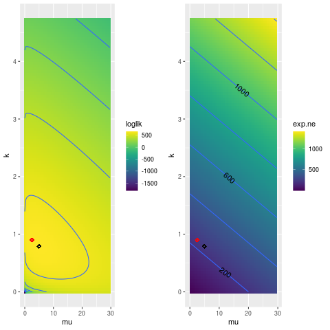
```


```{r, eval = TRUE}
# looking at parameters c and p
coeff = 5
c.int <- ML.est[3]*(1 + c(-coeff, coeff))
c.v <- seq(max(1e-15, c.int[1]), c.int[2], length.out = 100)

coeff = 3
p.int <- ML.est[4]*(1 + c(-coeff, coeff))
p.v <- seq(max(1e-10, p.int[1]), p.int[2], length.out = 100)

c.p.df <- expand.grid(c.v, p.v)
colnames(c.p.df) <- c('c', 'p')
```


```{r}
c.p.df$loglik <- sapply(1:nrow(c.p.df), 
                  function(x) 
                    hawkes.loglik(c(ML.est[1], 
                                    ML.est[2], 
                                    c.p.df$c[x], 
                                    c.p.df$p[x]), Tlim, ht$ts)) 

c.p.df$exp.ne <- sapply(1:nrow(c.p.df), 
                  function(x) 
                    exp.nev(c(ML.est[1], ML.est[2], 
                              c.p.df$c[x], 
                              c.p.df$p[x]), Tlim, ht$ts)) 


pl.loglik <- ggplot(c.p.df, aes(x = c, y = p, z = loglik, fill = loglik)) + 
  geom_tile() + 
  geom_contour() + 
  geom_point(aes(x = ML.est[3], y = ML.est[4], z = NULL, fill = NULL),
             shape = 23) + 
  geom_point(aes(x = true.parms[3], 
                 y = true.parms[4], z = NULL, fill = NULL),
             shape = 23, color = 'red') + 
  scale_fill_viridis()

pl.exp <- ggplot(c.p.df, aes(x = c, y = p, z = exp.ne, fill = exp.ne)) + 
  geom_tile() + 
  geom_contour() +
  geom_text_contour() + 
  geom_point(aes(x = ML.est[3], y = ML.est[4], z = NULL, fill = NULL),
             shape = 23) + 
  geom_point(aes(x = true.parms[3], 
                 y = true.parms[4], z = NULL, fill = NULL),
             shape = 23, color = 'red') + 
  scale_fill_viridis()

png('images/loglik.expectd.cp.png', width = 480, height = 480)
multiplot(pl.loglik, pl.exp, cols = 2)
dev.off()
```

```{r, eval = TRUE, out.width='100%', out.height='49%'}
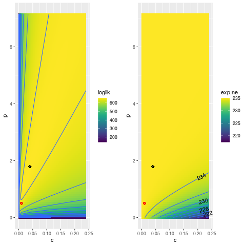
```

# First approximation method - Univariate analysis

Here, we explore the differences in two ways of approximating an Hawkes process model. The first one, relies on a linear approximation of the log-intensity. Considering now, $\boldsymbol \theta = (\mu, K, c, p)$ the approximation around a point $\boldsymbol \theta_0$ is given by:

$$
\overline{\log \lambda} (t, \boldsymbol \theta)|\boldsymbol \theta_0, \mathcal H_t = \frac{1}{\lambda_0} \sum_{i=1}^4 (\theta_i - \theta_{0,i}) \frac{\partial}{\partial \theta_i}\lambda \Bigg |_{\boldsymbol \theta = \boldsymbol \theta_0}
$$

Where, $\lambda_0 = \lambda(t, \boldsymbol \theta_0)$.

The parameters of the model has to be positive, except for $p > 1$. To ensure that, we are goig to consider a different parametrization. The parameters of interest are now $\boldsymbol \theta = (\theta_1,...,\theta_4)$ such that, $\mu = \exp \theta_1$, $K = \exp \theta_2$, $c = \exp \theta_3$, $p-1 = \exp(\theta_4)$. The derivatives with respect the new parametrization are:

$$
\frac{\partial}{\partial \theta_1} \lambda = \exp(\theta_1)
$$

$$
\frac{\partial}{\partial \theta_2} \lambda = \exp(\theta_2)\sum_{t_i < t} h(t - t_i, c, p)
$$

$$
\frac{\partial}{\partial \theta_3} \lambda = K(p-1)\exp((p-1)\theta_3)\sum_{t_i < t}(t- t_i + \exp(\theta_3))^{-p-1}\left[(p-1)(t-t_i) - \exp(\theta_3) \right]
$$

$$
\frac{\partial}{\partial \theta_4} \lambda = K\exp(\theta_4)c^{\exp(\theta_4) - 1}\sum_{t_i < t} (t - t_i + c)^{-\exp\theta_4}
$$

First thing, we check that the linearization works using the sample generated previously, here we vary a parameter and keep the others fixed at the value of the ML estimator. The exact and linearized log-intesity are considered at time $t = 5$, the latter is approximated around the ML estimator. Below, the plot shows the exact and linearized log-intensity as function of one parameter, the figure on the left shows the parameter in log scale, the plot on the right on its natural scale (except $p$ which is $p-1$ here). We remark that the log-intensity is linearized in the log scale and not in the natural scale of the parameters.

```{r, eval = TRUE}
# check linearization
mu.v <- unique(mu.k.df$mu)#seq(-6,10,length.out = 1000)
k.v <- unique(mu.k.df$k)#seq(-5, 5, length.out = 100)
cp.v <- unique(c.p.df$c)#seq(-10, 2, length.out = 100)
p.v <- unique(c.p.df$p)#seq(-10, 10, length.out = 100)
```


```{r, eval = TRUE}
mu.lim <- range(mu.k.df$mu)#exp(seq(-10,2,length.out = 100))

mu.v <- seq(mu.lim[1], mu.lim[2], length.out = 1000)

toplot.lambda.comparison(mu.v, par.idx = 1,
                        par0 = ML.est[1], ML.est = ML.est,
                        tt = 5, Ht = ht$ts, 
                        par.name = 'mu')
```


```{r, eval = TRUE}
# for k
k.lim <- range(mu.k.df$k)#exp(seq(-10,2,length.out = 100))

k.v <- seq(k.lim[1], k.lim[2], length.out = 1000)

toplot.lambda.comparison(k.v, par.idx = 2,
                        par0 = ML.est[2], ML.est = ML.est,
                        tt = 5, Ht = ht$ts, 
                        par.name = 'K')
```


```{r, eval = TRUE}
# c parameter
c.lim <- range(c.p.df$c)#exp(seq(-10,2,length.out = 100))

c.v <- seq(1e-4,#c.lim[1], #c.lim[2]
           10, length.out = 1000)

toplot.lambda.comparison(c.v, par.idx = 3,
                        par0 = 1, ML.est = ML.est,
                        tt = 5, Ht = ht$ts, 
                        par.name = 'c')
```


```{r, eval = TRUE}
# c parameter
p.lim <- range(c.p.df$p)#exp(seq(-10,2,length.out = 100))

p.v <- seq(1e-5, 7, length.out = 1000)

toplot.lambda.comparison(p.v, par.idx = 4,
                        par0 = 1, ML.est = ML.est,
                        tt = 5, Ht = ht$ts, 
                        par.name = 'p')
```

I am noticing that, the log-intensity with respect to $\theta_1 = \log(\mu)$ and $\theta_2 = \log(K)$ is just $\exp(\theta_1) + const$ in the first case and $const + \exp(\theta_2)*const_2$ in the second case. For this two, I think that linearizing is okay and provides an approximated log-intesity similar to the true one. In the case of $\theta_3 = log(c)$ and $\theta_4 = \log(p-1)$, instead, the log-intensity is "bell-shaped" and perhaps I think it will be more dangerous to approximate the log-intesity linearly. 

To check how the linearization works with respect one parameter at the time, we look at the values of the approximated log-likelihood of the parameters 1) keeping the other parameters equal to their ML estimate, the linearization is wrt to the ML estimate; 2) using data simulated from some known parametrization.

```{r, eval = TRUE}
rbind(true = true.parms,
      ML = ML.est)
```

Given a observations $\mathcal H_t = (t_1,...,t_N), t_i \in (0,T)$ and a set of points $t_{m1},...,t_{mP}$ such that $t_{mj} \in (0,T)$ and $t_{m(j+1)} - t_{mj} = w$ (the points are equidistant), the approximated log-likelihood is given by:

$$
\overline{\mathcal L}(\boldsymbol \theta) = -\sum_{j=1}^P \exp\{\overline{\log \lambda}(t_{mj}, \boldsymbol \theta)\}w + \sum_{i = 1}^N \overline{\log \lambda}(t_i, \boldsymbol \theta)
$$


```{r}
# check linearization for likelihood
mu.v <-  unique(mu.k.df$mu)
mu.v <- seq(min(mu.v), max(mu.v), length.out = 1000)
pl.mu <- toplot.loglik.dec(mu.v, 1, ML.est, Tlim, ht$ts,
                  ll.ylim = c(500, 700),
                  ss.ylim = c(500, 1050),
                  ee.ylim = c(0,500),
                  total.ylim = c(0,1050),
                  par.name = 'mu')

## 
png('images/mu.deco.three.png', width = 480, height = 480)
multiplot(plotlist = list( pl.mu$natural$three[[1]], pl.mu$natural$three[[2]],
                           pl.mu$natural$three[[3]],
                           pl.mu$log$three[[1]], pl.mu$log$three[[2]],
                           pl.mu$log$three[[3]] ), 
          layout = matrix(1:6, byrow = TRUE, ncol = 3))
dev.off()

png('images/mu.deco.one.png', width = 480, height = 480)
multiplot(plotlist = list( pl.mu$natural$one[[1]], pl.mu$natural$one[[2]],
                           pl.mu$log$one[[1]], pl.mu$log$one[[2]]), 
          layout = matrix(1:4, byrow = TRUE, ncol = 2))
dev.off()
```

```{r, eval = TRUE, out.width='100%', out.height='49%'}
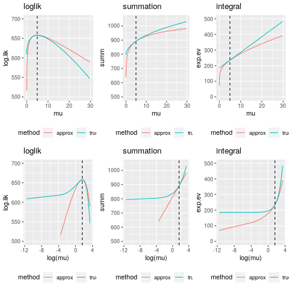
```

```{r, eval = TRUE, out.width='100%', out.height='49%'}
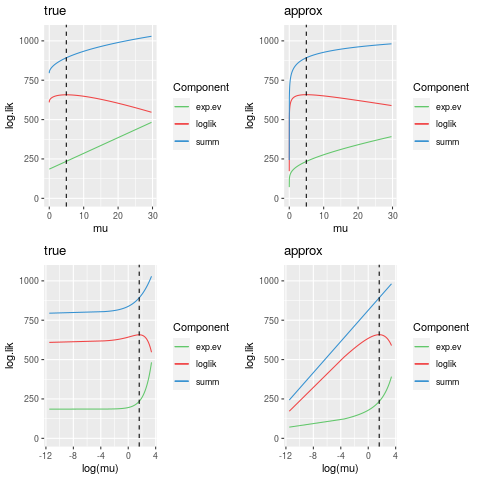
```


```{r}

# check linearization for likelihood
k.v <-  unique(mu.k.df$k)
k.v <- seq(min(k.v), max(k.v), length.out = 1000)
pl.k <- toplot.loglik.dec(k.v, 2, ML.est, Tlim, ht$ts,
                  ll.ylim = c(150, 700),
                  ss.ylim = c(750, 1300),
                  ee.ylim = c(0,1250),
                  total.ylim = c(0,1300),
                  par.name = 'k')

pl.k$log$three[[2]] <- pl.k$log$three[[2]] + ylim(250,1300)

png('images/k.deco.three.png', width = 480, height = 480)
multiplot(plotlist = list( pl.k$natural$three[[1]], pl.k$natural$three[[2]],
                           pl.k$natural$three[[3]],
                           pl.k$log$three[[1]], pl.k$log$three[[2]],
                           pl.k$log$three[[3]] ), 
          layout = matrix(1:6, byrow = TRUE, ncol = 3))
dev.off()


png('images/k.deco.one.png', width = 480, height = 480)
multiplot(plotlist = list( pl.k$natural$one[[1]], pl.k$natural$one[[2]],
                           pl.k$log$one[[1]], pl.k$log$one[[2]]), 
          layout = matrix(1:4, byrow = TRUE, ncol = 2))
dev.off()

```

```{r, eval = TRUE, out.width='100%', out.height='49%'}
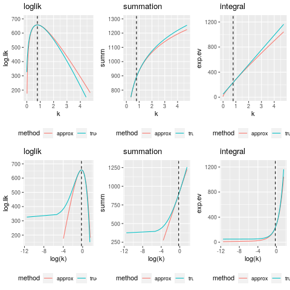
```

```{r, eval = TRUE, out.width='100%', out.height='49%'}
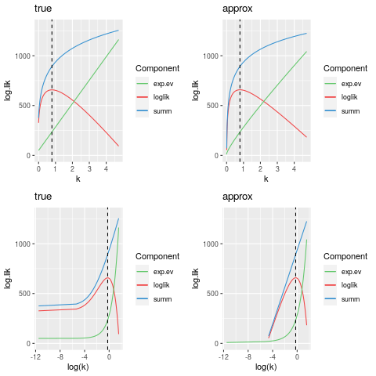
```

```{r}
# check linearization for likelihood
c.v <-  unique(c.p.df$c)
c.v <- seq(min(c.v), max(c.v), length.out = 1000)
pl.c <- toplot.loglik.dec(c.v, 3, ML.est, Tlim, ht$ts,
                  ll.ylim = c(400,750),
                  ss.ylim = c(500,1000),
                  ee.ylim = c(200,400),
                  total.ylim = c(200,1000),
                  par.name = 'c')


png('images/c.deco.three.png', width = 480, height = 480)
multiplot(plotlist = list( pl.c$natural$three[[1]], pl.c$natural$three[[2]],
                           pl.c$natural$three[[3]],
                           pl.c$log$three[[1]], pl.c$log$three[[2]],
                           pl.c$log$three[[3]] ), 
          layout = matrix(1:6, byrow = TRUE, ncol = 3))
dev.off()

png('images/c.deco.one.png', width = 480, height = 480)
multiplot(plotlist = list( pl.c$natural$one[[1]], pl.c$natural$one[[2]],
                           pl.c$log$one[[1]], pl.c$log$one[[2]]), 
          layout = matrix(1:4, byrow = TRUE, ncol = 2))
dev.off()

```

```{r, eval = TRUE, out.width='100%', out.height='49%'}
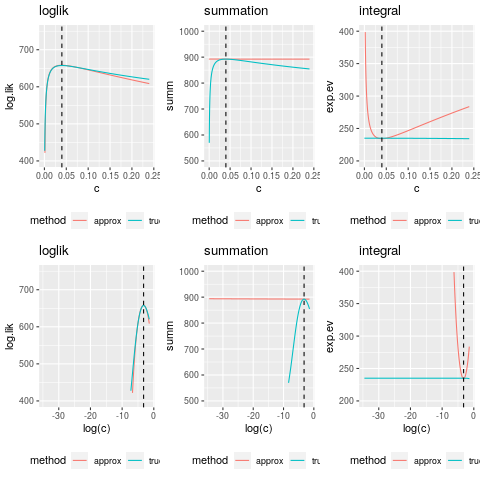
```

```{r, eval = TRUE, out.width='100%', out.height='49%'}
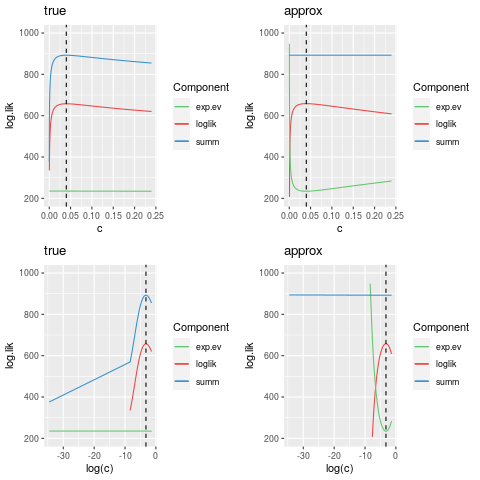
```

```{r}
p.v <-  unique(c.p.df$p)
p.v <-  seq(min(p.v), max(p.v), length.out = 1000)

pl.p <- toplot.loglik.dec(p.v, 4, ML.est, Tlim, ht$ts,
                  ll.ylim = c(550,700),
                  ss.ylim = c(800,950),
                  ee.ylim = c(200,300),
                  total.ylim = c(200,1000),
                  par.name = 'p')


png('images/p.deco.three.png', width = 480, height = 480)
multiplot(plotlist = list( pl.p$natural$three[[1]], pl.p$natural$three[[2]],
                           pl.p$natural$three[[3]],
                           pl.p$log$three[[1]], pl.p$log$three[[2]],
                           pl.p$log$three[[3]] ), 
          layout = matrix(1:6, byrow = TRUE, ncol = 3))
dev.off()

png('images/p.deco.one.png', width = 480, height = 480)
multiplot(plotlist = list( pl.p$natural$one[[1]], pl.p$natural$one[[2]],
                           pl.p$log$one[[1]], pl.p$log$one[[2]]), 
          layout = matrix(1:4, byrow = TRUE, ncol = 2))
dev.off()


```

```{r, eval = TRUE, out.width='100%', out.height='49%'}
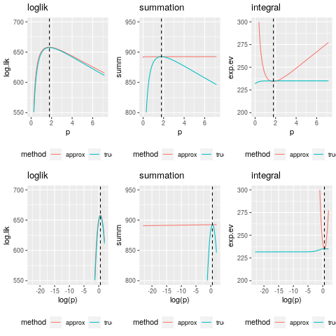
```

```{r, eval = TRUE, out.width='100%', out.height='49%'}
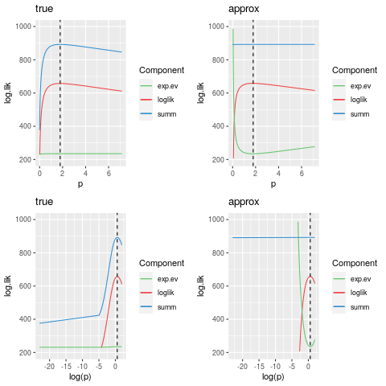
```

# Second approximation method - Univariate Analysis

Another way to approximate an Hawkes process model relies on the following view of the likelihood:


$$
\mathcal L(\mu, K, c, p) = -\mu T - \sum_{i=1}^N I_h(t_i, c, p) + \sum_{i=1}^N \log\lambda(t_i) 
$$
Where 

$$
I_h(t_i, \boldsymbol \theta) = K(1 - c^{p-1}(T - t_i + c)^{1-p})
$$

This likelihood can be seen as the sum of three Poisson counts likelihood with appropriate centroids, exposures and counts. In a Poisson counts model, the domain, which in this case is $(0,T)$, is divided in $B$ regions (bins) with centroids $t_{c1},...,t_{cB}$, having areas (width) $E_{ci}$. The observed data are the number of points observed in each region $N_{ci}$. Assuming that, in each region, the intensity is constant and equal to $\lambda(t_{ci})$, the expected number of points in each region is $E_{ci}\lambda(t_{ci})$. The log-likelihood of the model is 

$$
\mathcal L_{PC} = -\sum_{i = 1}^B E_{ci}\lambda(t_{ci}) + \sum_{i=1}^B\log(\lambda(t_{ci}))N_{ci}
$$

Let's see how we can use Poisson counts models to approximate the single component of the Point process likelhood. 

Let's suppose to have observed $t_1,...,t_N$ points, considering the observed points as centroids of the regions, setting for each region $i$, $E_{ci} = 0$ and $N_{ci} = 1$, the resulting log-likelihood of the Poisson counts model is 

$$
\mathcal L_{PC} = \sum_{i=1}^N \log\lambda(t_i)
$$

Which is the summation component of the Point process likelihood.

If we consider the observed points as centroids but we set $E_{ci} = 1$ and $N_{ci} = 0$ we obtain that

$$
\mathcal L_{PC} = -\sum_{i = 1}^N \lambda(t_i)
$$
Now, considering $\lambda(t_i) = I_h(t_i)$ we obtain the triggering part of the integral component of the Point process log-likelihood. 

Finally, considering just one region with exposure $E_1 = 1$, counts $N_1 = 0$ and $\lambda(t) = \mu T$ we obtain the background part of the integral component of the point process log-likelihood.

So we can see decompose the log-likelihood of a Point process model with intesity $\lambda(t)$ and observations $t_1,...,t_N$, as product of three Poisson counts likelihood with intensity $\lambda_1(t), \lambda_2(t), \lambda_3(t)$ with appropriate centroids, exposures and counts. The intensities of the Poisson counts models are given by:


$$
\lambda_1(t) = \lambda(t)
$$
$$
\lambda_2(t) = I_h(t)
$$
$$
\lambda_3(t) = \lambda_3 = T\mu
$$
The Point process log-likelihood can be rewritten as

$$
\mathcal L = -\lambda_3 - \sum_{i=1}^N \lambda_2(t_i) + \sum_{i=1}^N\log\lambda(t_i)
$$

# Use of the decomposition

We can use this decomposition to approximate each component separately. INLA works with Poisson counts models for which the log-intensity is linear. If it is not-linear the model is approximated as in the first approximation method exposed in the previous section. Therefore, in place of the summation component we have the linearized log-intensity as before. 

If $\log I_h$ is not linear in the parameters it will be linearized and $\overline{\log I_h}$ will be used.

Regarding the third component, considering $\mu = \exp(\theta_1)$ we see that

$$
\log \lambda_3 = \log(T) + \theta_1
$$

which is linear in $\theta_1$ and thus, it does not need to be approximated.

The resulting approximated likelihood is given by

$$
\overline{\mathcal L_2}(\boldsymbol \theta) = -\mu T - \sum_{i=1}^N \exp\Big\{\overline{\log I_h}(t_i,\boldsymbol \theta)\Big\} + \sum_{i=1}^N \overline{\log \lambda}(t_i,\boldsymbol \theta)
$$
Where

$$
\overline{\log I_h}(t_i, \boldsymbol \theta) = \log I_h(t_i,\boldsymbol \theta_0) + \sum_j (\theta_j - \theta_{0j})\frac{\partial}{\partial\theta_j} \log I_h \Bigg |_{\boldsymbol \theta = \boldsymbol \theta_0}
$$

Where

$$
I_h(t_i, \boldsymbol \theta) = K(1 - c^{p-1}(T - t_i + c)^{1-p})
$$

Considering that $\mu = \exp(\theta_1), K = \exp(\theta_2), c = \exp(\theta_3), p - 1 = \exp(\theta_4)$

$$
I_h(t_i, \boldsymbol \theta) = \exp(\theta_2)(1 - \exp\{\theta_3\exp(\theta_4)\}[T - t_i + \exp(\theta_3)]^{-\exp(\theta_4)})
$$
We have that

$$
\frac{\partial}{\partial \theta_2} \log I_h = 1
$$

$$
\frac{\partial}{\partial \theta_3} \log I_h = \frac{1}{I_h}\Big[-\exp(\theta_2)\Big( \exp\big\{\theta_3\exp(\theta_4) + \theta_4\big\}\big(T - t_i + \exp(\theta_3)\big)^{-\exp(\theta_4) - 1}(T-t_i)\Big) \Big]
$$


$$
\frac{\partial}{\partial \theta_4} \log I_h = \frac{1}{I_h}\Big[-\exp(\theta_2)\exp\big(\theta_4 + \theta_3\exp(\theta_4)\big)\big(T - t_i + \exp(\theta_3)\big)^{-\exp\theta_4}\big(\theta_3 - \log(T - t_i + \exp\theta_3)\big) \Big]
$$


Below, we show how the linearization approximate the function $\log I_h$ as a fuction of one parameter ($K, c, p$) at the time. We remark that the linearization is performed with respect the log of the parameters, except for $p$ for which the linearization is taken with respect to $\theta_4 = \log(p - 1)$. We notice that, the linearization approximate perfectly the functio with respect to $K$, this is because $\log I_h$ is a linear function of $\theta_2$. We show the approximate and exact $\log I_h$ as a function of $\theta_j$ and $\exp \theta_j$. We do the same with respect to $I_h$

```{r}
k.v <- unique(mu.k.df$k)

plot.kv <- toplot.I.comparison(par.values = k.v, 
                          par.idx = 2, 
                          par0 = ML.est[2],
                          ML.est = ML.est, 
                          Tlim = Tlim,
                          Ht = 1,
                          par.name = 'K')

png('images/logI.approx.k.png', width = 480, height = 480)
multiplot(plotlist = plot.kv$logI, cols = 2)
dev.off()

png('images/I.approx.k.png', width = 480, height = 480)
multiplot(plotlist = plot.kv$I, cols = 2)
dev.off()
```

```{r, eval = TRUE, out.width='100%', out.height='49%'}
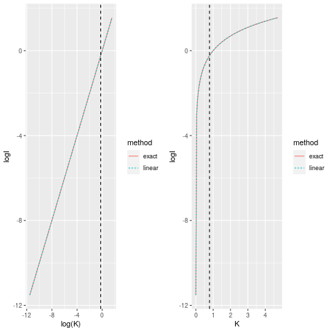
```

```{r, eval = TRUE, out.width='100%', out.height='49%'}
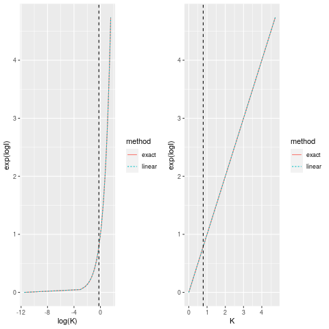
```

```{r, eval = TRUE}
c.v <- unique(c.p.df$c)

plot.cv <- toplot.I.comparison(par.values = c.v, 
                          par.idx = 3, 
                          par0 = ML.est[3],
                          ML.est = ML.est, 
                          Tlim = Tlim,
                          Ht = 1,
                          par.name = 'c')

png('images/logI.approx.c.png', width = 480, height = 480)
multiplot(plotlist = plot.cv$logI, cols = 2)
dev.off()

png('images/I.approx.c.png', width = 480, height = 480)
multiplot(plotlist = plot.cv$I, cols = 2)
dev.off()

```

```{r, eval = TRUE, out.width='100%', out.height='49%'}
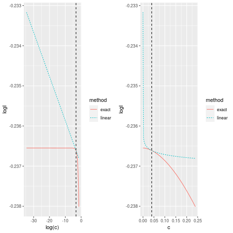
```

```{r, eval = TRUE, out.width='100%', out.height='49%'}
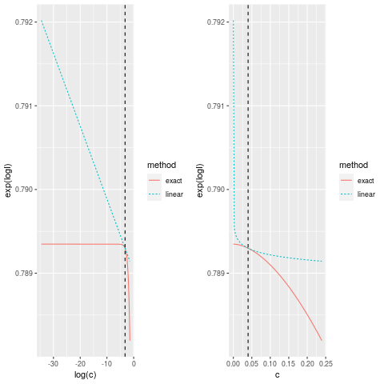
```

```{r, eval = TRUE}
p.v <- unique(c.p.df$p)

plot.pv <- toplot.I.comparison(par.values = p.v, 
                          par.idx = 4, 
                          par0 = ML.est[4],
                          ML.est = ML.est, 
                          Tlim = Tlim,
                          Ht = 1,
                          par.name = 'p - 1')


png('images/logI.approx.p.png', width = 480, height = 480)
multiplot(plotlist = plot.pv$logI, cols = 2)
dev.off()

png('images/I.approx.p.png', width = 480, height = 480)
multiplot(plotlist = plot.pv$I, cols = 2)
dev.off()

```

```{r, eval = TRUE, out.width='100%', out.height='49%'}
knitr::include_graphics('images/logI.approx.p.png')
```

```{r, eval = TRUE, out.width='100%', out.height='49%'}
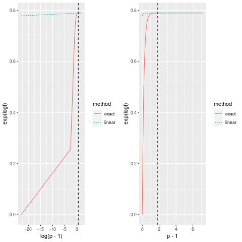
```

# Expected value approximation comparison - Univariate Analysis

Here, we compare the two expected value approximations. The first one is based on numerical integration of the exponential of the linearized log-intensity while the second is based on a linearization of the log of the triggerig component of the integral. We expect the second method to be more accurate than the first one. 

We compare the expected values varying one parameter at the time 

```{r}
exp.nev.lin2 <- function(params, Tlim, Ht, theta0){
  first.c <- Tlim*params[1]
  second.c <- sum(sapply(Ht, function(ti) 
    exp(lin.log.I(Tlim, log(params), ti, theta0))))
  first.c + second.c
}
  
  
hawkes.loglik.lin2 <- function(params, Tlim, Ht, theta0){
  exp.v <- exp.nev.lin2(params, Tlim, Ht, theta0)
  summ.c <- sum(lin.log.lambda2(Ht, log(params), Ht, theta0))
  - exp.v + summ.c
}
```

Varying $\mu$ and $K$ the second method is exact. Also with respect to $c$ and $p$ the second approximation method provides better approximation of the expected value. However, we are going to see in the next section that this may not be desirable.

```{r}
mu.v <- unique(mu.k.df$mu)

png('images/exp.v.comparison.mu.png', width = 480, height = 480)
toplot.exp.approx.comparison(mu.v, 1, par0 = ML.est[1],
                             ML.est = ML.est, Tlim = Tlim,
                             Ht = ht$ts, par.name = 'mu',
                             ee.lim = c(0, 500))
dev.off()
```


```{r, eval = TRUE, out.width='100%', out.height='49%'}
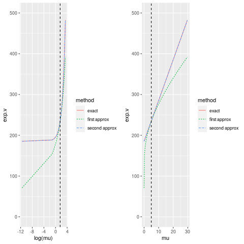
```

```{r}
k.v <- unique(mu.k.df$k)

png('images/exp.v.comparison.K.png', width = 480, height = 480)
toplot.exp.approx.comparison(k.v, 2, par0 = ML.est[2],
                             ML.est = ML.est, Tlim = Tlim,
                             Ht = ht$ts, par.name = 'K')
dev.off()
```


```{r, eval = TRUE, out.width='100%', out.height='49%'}
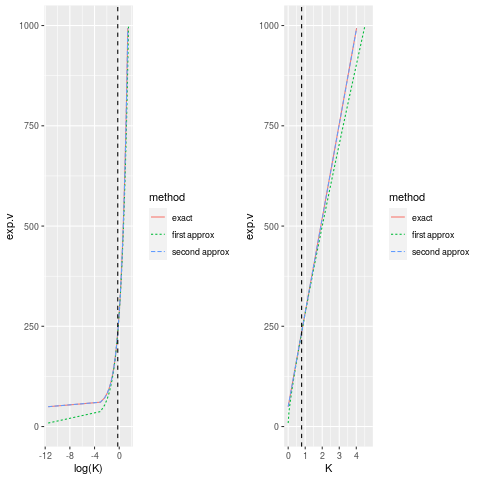
```


```{r}
c.v <- unique(c.p.df$c)

png('images/exp.v.comparison.c.png', width = 480, height = 480)
toplot.exp.approx.comparison(c.v, 3, par0 = ML.est[3],
                             ML.est = ML.est, Tlim = Tlim,
                             Ht = ht$ts, par.name = 'c',
                             ee.lim = c(200,400))
dev.off()
```


```{r, eval = TRUE, out.width='100%', out.height='49%'}
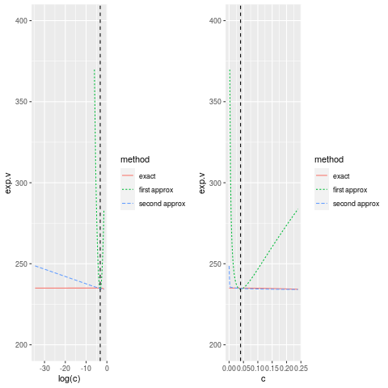
```

```{r}
p.v <- unique(c.p.df$p)

png('images/exp.v.comparison.p.png', width = 480, height = 480)
toplot.exp.approx.comparison(p.v, 4, par0 = ML.est[4],
                             ML.est = ML.est, Tlim = Tlim,
                             Ht = ht$ts, par.name = 'p-1',
                             ee.lim = c(200,500))
dev.off()
```


```{r, eval = TRUE, out.width='100%', out.height='49%'}
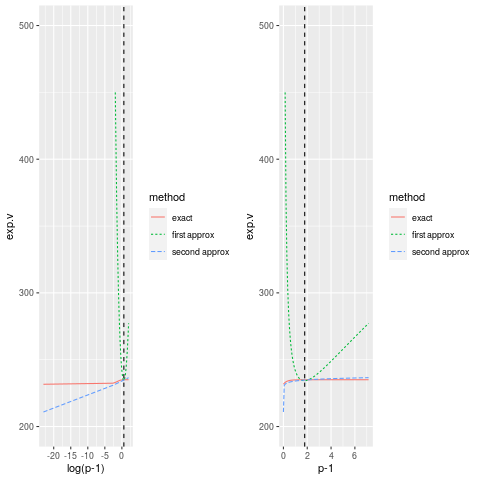
```


# Log-likelihood approximation comparison - Univariate Analysis

Here we compare the approximated log-likelihoods using the two methods exposed before. They differs solely on how they approximate the integral of the intensity over the domain of interest (integral component of the log-likelihood). We have seen before that the second approximation method provides better approximations of the expected value and we say that, however, it may not be desirable. Here, we show why, showing the log-likelihood as function of one parameter at the time, the others are fixed to their ML estimate. Also the linearizations are performed with respect to the ML estimates of the parameters. 

It is clear looking at the log-likelihood as function of $c$ and $p-1$ that, regarding the first approximation, the error in the integral component approximation somehow compensates for the error in the summation component approximation. I have no idea why, but the resulting approximated log-likelihood is similar to the true one. The second approximation method, instead, even if it approximate better the integral component, brings the same error on the summation component. This error is not compensated by the error in the integral componenet and leads to a biased log-likelihood approximation.

```{r}
mu.v <-  unique(mu.k.df$mu)
mu.v <- seq(min(mu.v), max(mu.v), length.out = 1000)
pl.mu <- toplot.loglik.dec.comparison(mu.v, 1, ML.est, Tlim, ht$ts,
                  ll.ylim = c(500, 700),
                  ss.ylim = c(500, 1050),
                  ee.ylim = c(0,500),
                  total.ylim = c(0,1050),
                  par.name = 'mu')


## 
png('images/mu.deco.comp.three.png', width = 480*1.5, height = 480)
multiplot(plotlist = list( pl.mu$natural$three[[1]], pl.mu$natural$three[[2]],
                           pl.mu$natural$three[[3]],
                           pl.mu$log$three[[1]], pl.mu$log$three[[2]],
                           pl.mu$log$three[[3]] ), 
          layout = matrix(1:6, byrow = TRUE, ncol = 3))
dev.off()

png('images/mu.deco.comp.one.png', width = 480*1.5, height = 480)
multiplot(plotlist = list( pl.mu$natural$one[[1]], pl.mu$natural$one[[2]],
                           pl.mu$natural$one[[3]],
                           pl.mu$log$one[[1]], pl.mu$log$one[[2]],
                           pl.mu$log$one[[3]]),
          layout = matrix(1:6, byrow = TRUE, ncol = 3))
dev.off()

```


```{r, eval = TRUE, out.width='100%', out.height='49%'}
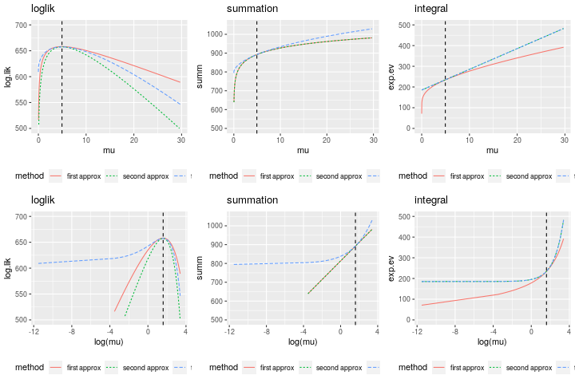
```


```{r, eval = TRUE, out.width='100%', out.height='49%'}
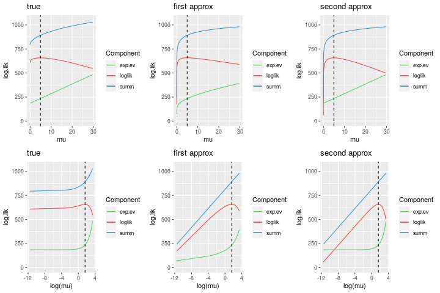
```

```{r}
k.v <-  unique(mu.k.df$k)
k.v <- seq(min(k.v), max(k.v), length.out = 1000)
pl.k <- toplot.loglik.dec.comparison(k.v, 2, ML.est, Tlim, ht$ts,
                  ll.ylim = c(500, 700),
                  ss.ylim = c(500, 1050),
                  ee.ylim = c(0,500),
                  total.ylim = c(0,1050),
                  par.name = 'K')

## 
png('images/k.deco.comp.three.png', width = 480*1.5, height = 480)
multiplot(plotlist = list( pl.k$natural$three[[1]], pl.k$natural$three[[2]],
                           pl.k$natural$three[[3]],
                           pl.k$log$three[[1]], pl.k$log$three[[2]],
                           pl.k$log$three[[3]] ), 
          layout = matrix(1:6, byrow = TRUE, ncol = 3))
dev.off()

png('images/k.deco.comp.one.png', width = 480*1.5, height = 480)
multiplot(plotlist = list( pl.k$natural$one[[1]], pl.k$natural$one[[2]],
                           pl.k$natural$one[[3]],
                           pl.k$log$one[[1]], pl.k$log$one[[2]],
                           pl.k$log$one[[3]]),
          layout = matrix(1:6, byrow = TRUE, ncol = 3))
dev.off()

```


```{r, eval = TRUE, out.width='100%', out.height='49%'}
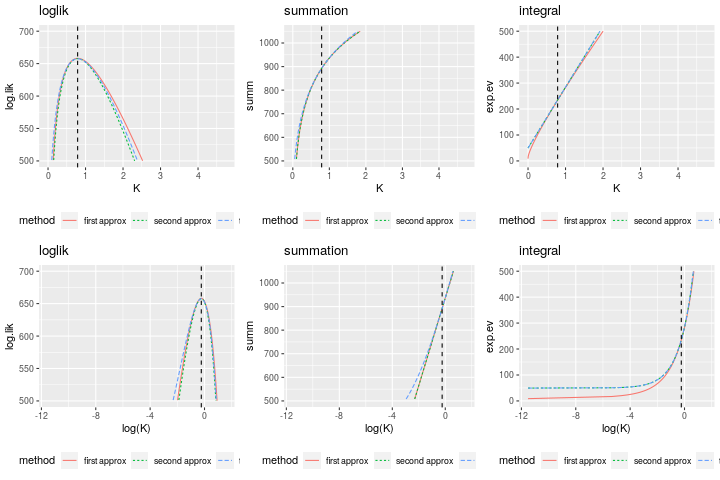
```

```{r,eval = TRUE, out.width='100%', out.height='49%'}
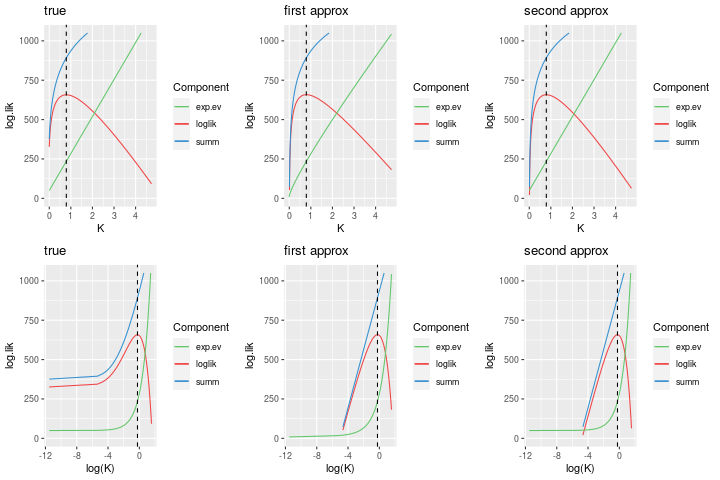
```

```{r}
c.v <-  unique(c.p.df$c)
c.v <- seq(min(c.v), max(c.v), length.out = 1000)
pl.c <- toplot.loglik.dec.comparison(c.v, 3, ML.est, Tlim, ht$ts,
                  ll.ylim = c(500, 700),
                  ss.ylim = c(500, 1050),
                  ee.ylim = c(0,500),
                  total.ylim = c(0,1050),
                  par.name = 'c')

## 
png('images/c.deco.comp.three.png', width = 480*1.5, height = 480)
multiplot(plotlist = list( pl.c$natural$three[[1]], pl.c$natural$three[[2]],
                           pl.c$natural$three[[3]],
                           pl.c$log$three[[1]], pl.c$log$three[[2]],
                           pl.c$log$three[[3]] ), 
          layout = matrix(1:6, byrow = TRUE, ncol = 3))
dev.off()

png('images/c.deco.comp.one.png', width = 480*1.5, height = 480)
multiplot(plotlist = list( pl.c$natural$one[[1]], pl.c$natural$one[[2]],
                           pl.c$natural$one[[3]],
                           pl.c$log$one[[1]], pl.c$log$one[[2]],
                           pl.c$log$one[[3]]),
          layout = matrix(1:6, byrow = TRUE, ncol = 3))
dev.off()

```


```{r, eval = TRUE, out.width='100%', out.height='49%'}
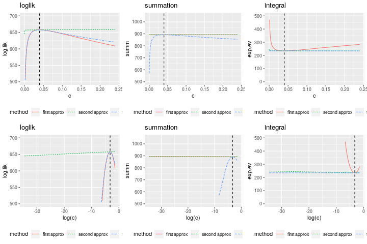
```

```{r,eval = TRUE, out.width='100%', out.height='49%'}
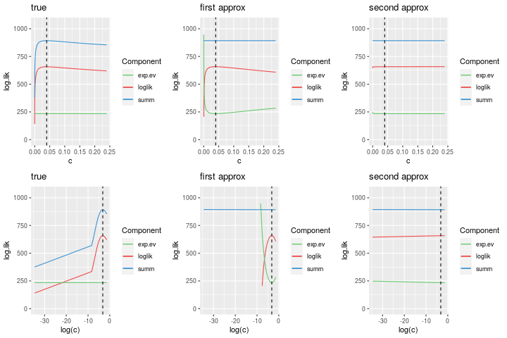
```


```{r}
p.v <-  unique(c.p.df$p)
p.v <- seq(min(p.v), max(p.v), length.out = 1000)
pl.p <- toplot.loglik.dec.comparison(p.v, 4, ML.est, Tlim, ht$ts,
                  ll.ylim = c(500, 700),
                  ss.ylim = c(500, 1050),
                  ee.ylim = c(0,500),
                  total.ylim = c(0,1050),
                  par.name = 'c')

## 
png('images/p.deco.comp.three.png', width = 480*1.5, height = 480)
multiplot(plotlist = list( pl.p$natural$three[[1]], pl.p$natural$three[[2]],
                           pl.p$natural$three[[3]],
                           pl.p$log$three[[1]], pl.p$log$three[[2]],
                           pl.p$log$three[[3]] ), 
          layout = matrix(1:6, byrow = TRUE, ncol = 3))
dev.off()

png('images/p.deco.comp.one.png', width = 480*1.5, height = 480)
multiplot(plotlist = list( pl.p$natural$one[[1]], pl.p$natural$one[[2]],
                           pl.p$natural$one[[3]],
                           pl.p$log$one[[1]], pl.p$log$one[[2]],
                           pl.p$log$one[[3]]),
          layout = matrix(1:6, byrow = TRUE, ncol = 3))
dev.off()

```


```{r, eval = TRUE, out.width='100%', out.height='49%'}
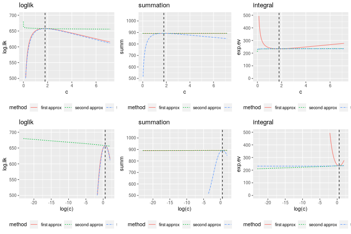
```

```{r,eval = TRUE, out.width='100%', out.height='49%'}
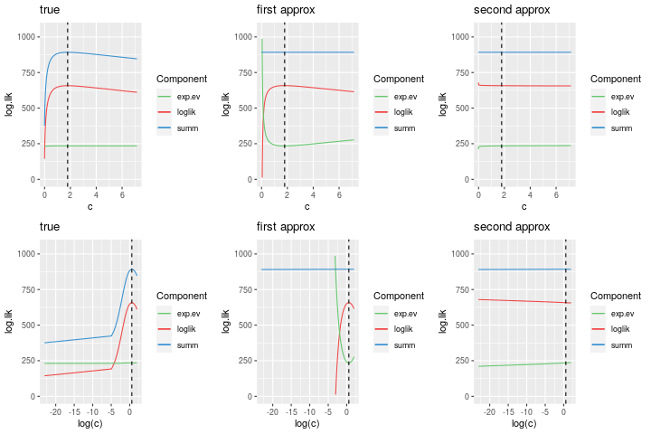
```

# Log-likelihood approximation comparison - Bivariate Analysis 

Here, we basically repeat the visual analysis done in the previous section but varying two parameters at the time. Given the role of each parameters we consider only two couples: the productiivity parameters $\mu, K$ and the tempora triggering parameters $c, p$.
```{r}

# with respect mu and k

mu.k.df$loglik.lin <- sapply(1:nrow(mu.k.df), 
                  function(x) 
                    hawkes.loglik.lin(c(mu.k.df$mu[x], 
                                        mu.k.df$k[x], 
                                        ML.est[3], 
                                        ML.est[4]), Tlim, ht$ts,
                                      log(ML.est))) 


mu.k.df$loglik.lin2 <- sapply(1:nrow(mu.k.df), 
                  function(x) 
                    hawkes.loglik.lin2(c(mu.k.df$mu[x], 
                                        mu.k.df$k[x], 
                                        ML.est[3], 
                                        ML.est[4]), Tlim, ht$ts,
                                      log(ML.est))) 


toplot.2D <- function(x, y, z, df.p, zbreaks, zlim, pl.title, 
                      vlab){
  df <- data.frame(x = x, y = y, z = z)
  
  ggplot(df, aes(x = x, y = y, z = z, fill = z)) + 
    geom_tile() + 
    geom_contour(breaks = zbreaks) + 
    geom_point(data = df.p, aes(x = x, y = y, z = NULL, fill = NULL, colour = param),
               shape = 23) + 
    scale_fill_viridis(limits = zlim) +
    scale_color_manual(values = c('red', 'black')) +
    #scale_color_manual(c('black', 'red')) + 
    labs(title = pl.title,
         fill = vlab[3]) + xlab(vlab[1]) + ylab(vlab[2])

}


mu.k.df$exp.ne.lin <- sapply(1:nrow(mu.k.df), 
                  function(x)
                    exp.nev.lin(c(mu.k.df$mu[x],  mu.k.df$k[x], 
                                  ML.est[3], ML.est[4]),
                                Tlim, ht$ts, log(ML.est))) 


mu.k.df$exp.ne.lin2 <- sapply(1:nrow(mu.k.df), 
                  function(x)
                    exp.nev.lin2(c(mu.k.df$mu[x],  mu.k.df$k[x], 
                                  ML.est[3], ML.est[4]),
                                Tlim, ht$ts, log(ML.est))) 

df.p.muk <- rbind(data.frame(x = true.parms[1], y = true.parms[2], param = 'true'),
                  data.frame(x = ML.est[1], y = ML.est[2], param = 'ML'))

ll.lim <- range(mu.k.df$loglik)
#ll.lim <- c(140,700)
ll.bk <- seq(ll.lim[1], ll.lim[2], length.out = 50)

pl.loglik <- toplot.2D(x = mu.k.df$mu, y = mu.k.df$k, z = mu.k.df$loglik, 
                       df.p = df.p.muk, zbreaks = ll.bk, zlim = ll.lim, 
                       pl.title = 'True Log-lik', vlab = c('mu', 'K', 'loglik'))

pl.loglik.lin <- toplot.2D(x = mu.k.df$mu, y = mu.k.df$k, z = mu.k.df$loglik.lin, 
                       df.p = df.p.muk, zbreaks = ll.bk, zlim = ll.lim, 
                       pl.title = 'First approx Log-lik', vlab = c('mu', 'K', 'loglik'))

pl.loglik.lin2 <- toplot.2D(x = mu.k.df$mu, y = mu.k.df$k, z = mu.k.df$loglik.lin2, 
                       df.p = df.p.muk, zbreaks = ll.bk, zlim = ll.lim, 
                       pl.title = 'Second approx Log-lik', vlab = c('mu', 'K', 'loglik'))


ev.lim <- range(mu.k.df$exp.ne)
ev.bk <- seq(ev.lim[1], ev.lim[2], length.out = 10)

pl.ev <- toplot.2D(x = mu.k.df$mu, y = mu.k.df$k, z = mu.k.df$exp.ne, 
                       df.p = df.p.muk, zbreaks = ev.bk, zlim = ev.lim, 
                       pl.title = 'True Integral', vlab = c('mu', 'K', 'ev'))+ 
  geom_text_contour()


pl.ev.lin <- toplot.2D(x = mu.k.df$mu, y = mu.k.df$k, z = mu.k.df$exp.ne.lin, 
                       df.p = df.p.muk, zbreaks = ev.bk, zlim = ev.lim, 
                       pl.title = 'First approx Integral', vlab = c('mu', 'K', 'ev'))+ 
  geom_text_contour()


pl.ev.lin2 <- toplot.2D(x = mu.k.df$mu, y = mu.k.df$k, z = mu.k.df$exp.ne.lin2, 
                       df.p = df.p.muk, zbreaks = ev.bk, zlim = ev.lim, 
                       pl.title = 'Second approx Integral', vlab = c('mu', 'K', 'ev'))+ 
  geom_text_contour()

# summation component wrt mu and k

ss.lim <- range(mu.k.df$loglik + mu.k.df$exp.ne)
ss.bk <- seq(ss.lim[1], ss.lim[2], length.out = 30)

pl.sum <- toplot.2D(x = mu.k.df$mu, y = mu.k.df$k, 
                    z = mu.k.df$loglik + mu.k.df$exp.ne, 
                       df.p = df.p.muk, zbreaks = ss.bk, zlim = ss.lim, 
                       pl.title = 'True sum', vlab = c('mu', 'K', 'sum'))


pl.sum.lin <- toplot.2D(x = mu.k.df$mu, y = mu.k.df$k, 
                    z = mu.k.df$loglik.lin + mu.k.df$exp.ne.lin, 
                       df.p = df.p.muk, zbreaks = ss.bk, zlim = ss.lim, 
                       pl.title = 'First approx sum', vlab = c('mu', 'K', 'sum'))


pl.sum.lin2 <- toplot.2D(x = mu.k.df$mu, y = mu.k.df$k, 
                    z = mu.k.df$loglik.lin2 + mu.k.df$exp.ne.lin2, 
                       df.p = df.p.muk, zbreaks = ss.bk, zlim = ss.lim, 
                       pl.title = 'Second approx sum', vlab = c('mu', 'K', 'sum'))

png('images/loglik.deco.comparison.muk.png', width = 480*2, height = 480*2)
multiplot(pl.loglik, pl.sum, pl.ev,
          pl.loglik.lin, pl.sum.lin, pl.ev.lin, 
          pl.loglik.lin2, pl.sum.lin2, pl.ev.lin2, 
          layout = matrix(1:9, byrow = T, ncol = 3))
dev.off()

```

```{r, eval = TRUE, out.width='100%', out.height='99%'}
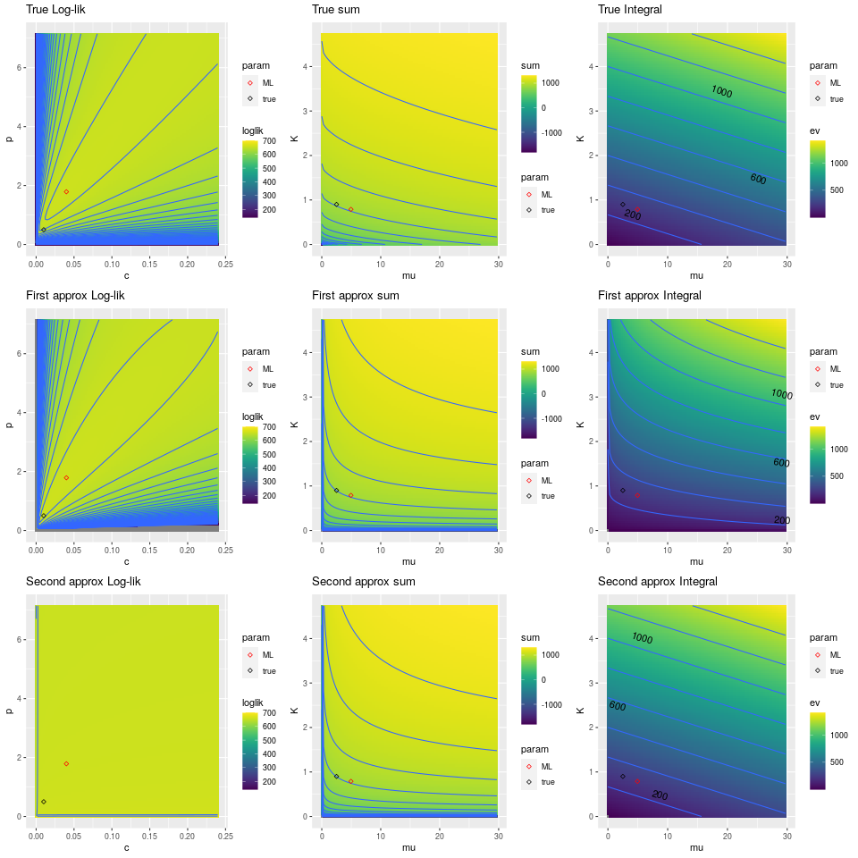
```


```{r}
# repeat in log-scale
lmu <- seq(log(min(mu.k.df$mu)), log(max(mu.k.df$mu)), length.out = 100)
lk <- seq(log(min(mu.k.df$k)), log(max(mu.k.df$k)), length.out = 100)

mu.k.df.log <- expand.grid(lmu, lk)
colnames(mu.k.df.log) <- c('log.mu', 'log.K')


mu.k.df.log$loglik <- sapply(1:nrow(mu.k.df.log), 
                  function(x) 
                    hawkes.loglik(c(exp(mu.k.df.log$log.mu[x]), 
                                        exp(mu.k.df.log$log.K[x]), 
                                        ML.est[3], 
                                        ML.est[4]), Tlim, ht$ts)) 

mu.k.df.log$loglik.lin <- sapply(1:nrow(mu.k.df.log), 
                  function(x) 
                    hawkes.loglik.lin(c(exp(mu.k.df.log$log.mu[x]), 
                                        exp(mu.k.df.log$log.K[x]), 
                                        ML.est[3], 
                                        ML.est[4]), Tlim, ht$ts,
                                      log(ML.est))) 

mu.k.df.log$loglik.lin2 <- sapply(1:nrow(mu.k.df.log), 
                  function(x) 
                    hawkes.loglik.lin2(c(exp(mu.k.df.log$log.mu[x]), 
                                        exp(mu.k.df.log$log.K[x]), 
                                        ML.est[3], 
                                        ML.est[4]), Tlim, ht$ts,
                                      log(ML.est))) 

mu.k.df.log$ev <- sapply(1:nrow(mu.k.df.log), 
                  function(x) 
                    exp.nev(c(exp(mu.k.df.log$log.mu[x]), 
                                  exp(mu.k.df.log$log.K[x]), 
                                  ML.est[3], 
                                  ML.est[4]), Tlim, ht$ts)) 

mu.k.df.log$ev.lin <- sapply(1:nrow(mu.k.df.log), 
                  function(x) 
                    exp.nev.lin(c(exp(mu.k.df.log$log.mu[x]), 
                                  exp(mu.k.df.log$log.K[x]), 
                                  ML.est[3], 
                                  ML.est[4]), Tlim, ht$ts, log(ML.est))) 

mu.k.df.log$ev.lin2 <- sapply(1:nrow(mu.k.df.log), 
                  function(x) 
                    exp.nev.lin2(c(exp(mu.k.df.log$log.mu[x]), 
                                  exp(mu.k.df.log$log.K[x]), 
                                  ML.est[3], 
                                  ML.est[4]), Tlim, ht$ts, log(ML.est)))


save(mu.k.df.log, file = 'mu.k.df.log.RData')
```


```{r}
#plotting
df.p.muk.log <- rbind(data.frame(x = log(true.parms[1]), y = log(true.parms[2]), 
                                 param = 'true'),
                  data.frame(x = log(ML.est[1]), y = log(ML.est[2]), param = 'ML'))

ll.lim <- range(mu.k.df.log$loglik)
ll.bk <- seq(ll.lim[1], ll.lim[2], length.out = 30)

pl.loglik.log <- 
  toplot.2D(x = mu.k.df.log$log.mu, y = mu.k.df.log$log.K, z = mu.k.df.log$loglik, 
            df.p = df.p.muk.log, zbreaks = ll.bk, zlim = ll.lim, 
            pl.title = 'True Log-lik', vlab = c('log(mu)', 'log(K)', 'loglik'))

pl.loglik.lin.log <- 
  toplot.2D(x = mu.k.df.log$log.mu, y = mu.k.df.log$log.K, z = mu.k.df.log$loglik.lin, 
            df.p = df.p.muk.log, zbreaks = ll.bk, zlim = ll.lim, 
            pl.title = 'First approx Log-lik', vlab = c('log(mu)', 'log(K)', 'loglik'))

pl.loglik.lin2.log <- 
  toplot.2D(x = mu.k.df.log$log.mu, y = mu.k.df.log$log.K, z = mu.k.df.log$loglik.lin2, 
            df.p = df.p.muk.log, zbreaks = ll.bk, zlim = ll.lim, 
            pl.title = 'Second approx Log-lik', vlab = c('log(mu)', 'log(K)', 'loglik'))


pl.ev.log <- 
  toplot.2D(x = mu.k.df.log$log.mu, y = mu.k.df.log$log.K, z = mu.k.df.log$ev, 
            df.p = df.p.muk.log, zbreaks = ev.bk, zlim = ev.lim, 
            pl.title = 'True Integral', vlab = c('log(mu)', 'log(K)', 'ev'))+ 
  geom_text_contour()


pl.ev.lin.log <- 
  toplot.2D(x = mu.k.df.log$log.mu, y = mu.k.df.log$log.K, z = mu.k.df.log$ev.lin, 
            df.p = df.p.muk.log, zbreaks = ev.bk, zlim = ev.lim, 
            pl.title = 'First approx Integral', vlab = c('log(mu)', 'log(K)', 'ev'))+ 
  geom_text_contour()


pl.ev.lin2.log <- 
  toplot.2D(x = mu.k.df.log$log.mu, y = mu.k.df.log$log.K, z = mu.k.df.log$ev.lin2, 
            df.p = df.p.muk.log, zbreaks = ev.bk, zlim = ev.lim, 
            pl.title = 'Second approx Integral', vlab = c('log(mu)', 'log(K)', 'ev'))+ 
  geom_text_contour()

# summation component wrt mu and k

pl.sum.log <- toplot.2D(x = mu.k.df.log$log.mu, y = mu.k.df.log$log.K, 
                    z = mu.k.df.log$loglik + mu.k.df.log$ev, 
                       df.p = df.p.muk.log, zbreaks = ss.bk, zlim = ss.lim, 
                       pl.title = 'True sum', vlab = c('log(mu)', 'log(K)', 'sum'))


pl.sum.lin.log <- toplot.2D(x = mu.k.df.log$log.mu, y = mu.k.df.log$log.K, 
                    z = mu.k.df.log$loglik.lin + mu.k.df.log$ev.lin, 
                       df.p = df.p.muk.log, zbreaks = ss.bk, zlim = ss.lim, 
                       pl.title = 'First approx sum', vlab = c('log(mu)', 'log(K)', 'sum'))


pl.sum.lin2.log <- toplot.2D(x = mu.k.df.log$log.mu, y = mu.k.df.log$log.K, 
                    z = mu.k.df.log$loglik.lin2 + mu.k.df.log$ev.lin2, 
                       df.p = df.p.muk.log, zbreaks = ss.bk, zlim = ss.lim, 
                       pl.title = 'Second approx sum', vlab = c('log(mu)', 'log(K)', 'sum'))

png('images/loglik.deco.comparison.logsc.muk.png', width = 480*2, height = 480*2)
multiplot(pl.loglik.log, pl.sum.log, pl.ev.log,
          pl.loglik.lin.log, pl.sum.lin.log, pl.ev.lin.log, 
          pl.loglik.lin2.log, pl.sum.lin2.log, pl.ev.lin2.log, 
          layout = matrix(1:9, byrow = T, ncol = 3))
dev.off()

```

```{r, eval = TRUE, out.width='100%', out.height='99%'}
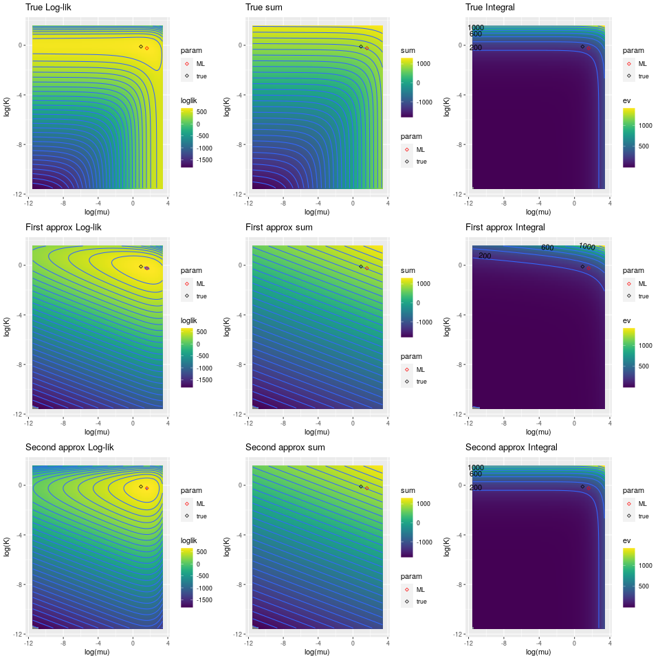
```


```{r}
########################
# with respect c and p #
########################

c.p.df$loglik.lin <- sapply(1:nrow(c.p.df), 
                  function(x) 
                    hawkes.loglik.lin(c(ML.est[1],
                                        ML.est[2],
                                        c.p.df$c[x], 
                                        c.p.df$p[x]), Tlim, ht$ts,
                                      log(ML.est))) 


c.p.df$loglik.lin2 <- sapply(1:nrow(c.p.df), 
                  function(x) 
                    hawkes.loglik.lin2(c(ML.est[1],
                                        ML.est[2],
                                        c.p.df$c[x], 
                                        c.p.df$p[x]), Tlim, ht$ts,
                                      log(ML.est)))


c.p.df$exp.ne.lin <- sapply(1:nrow(c.p.df), 
                  function(x)
                    exp.nev.lin(c(ML.est[1], ML.est[2],
                                  c.p.df$c[x],  c.p.df$p[x]),
                                Tlim, ht$ts, log(ML.est))) 


c.p.df$exp.ne.lin2 <- sapply(1:nrow(c.p.df), 
                  function(x)
                    exp.nev.lin2(c(ML.est[1], ML.est[2],
                                  c.p.df$c[x],  c.p.df$p[x]),
                                Tlim, ht$ts, log(ML.est))) 

save(c.p.df, file = 'c.p.df.RData')
```


```{r}
df.p.cp <- rbind(data.frame(x = true.parms[3], y = true.parms[4], param = 'true'),
                  data.frame(x = ML.est[3], y = ML.est[4], param = 'ML'))

ll.lim <- range(c.p.df$loglik)
ll.lim <- c(140,700)
ll.bk <- seq(ll.lim[1], ll.lim[2], length.out = 50)

pl.loglik <- toplot.2D(x = c.p.df$c, y = c.p.df$p, z = c.p.df$loglik, 
                       df.p = df.p.cp, zbreaks = ll.bk, zlim = ll.lim, 
                       pl.title = 'True Log-lik', vlab = c('c', 'p-1', 'loglik'))

pl.loglik.lin <- toplot.2D(x = c.p.df$c, y = c.p.df$p, z = c.p.df$loglik.lin, 
                       df.p = df.p.cp, zbreaks = ll.bk, zlim = ll.lim, 
                       pl.title = 'First approx Log-lik', vlab = c('c', 'p-1', 'loglik'))

pl.loglik.lin2 <- toplot.2D(x = c.p.df$c, y = c.p.df$p, z = c.p.df$loglik.lin2, 
                       df.p = df.p.cp, zbreaks = ll.bk, zlim = ll.lim, 
                       pl.title = 'Second approx Log-lik', vlab = c('c', 'p-1', 'loglik'))


ev.lim <- range(c.p.df$exp.ne)
ev.lim <- c(217, 300)
ev.bk <- seq(ev.lim[1], ev.lim[2], length.out = 10)

pl.ev <- toplot.2D(x = c.p.df$c, y = c.p.df$p, z = c.p.df$exp.ne, 
                       df.p = df.p.cp, zbreaks = ev.bk, zlim = ev.lim, 
                       pl.title = 'True Integral', vlab = c('c', 'p-1', 'ev')) + 
  geom_text_contour()

pl.ev.lin <- toplot.2D(x = c.p.df$c, y = c.p.df$p, z = c.p.df$exp.ne.lin, 
                       df.p = df.p.cp, zbreaks = ev.bk, zlim = ev.lim, 
                       pl.title = 'First approx Integral', vlab = c('c', 'p-1', 'ev'))+ 
  geom_text_contour()


pl.ev.lin2 <- toplot.2D(x = c.p.df$c, y = c.p.df$p, z = c.p.df$exp.ne.lin2, 
                       df.p = df.p.cp, zbreaks = ev.bk, zlim = ev.lim, 
                       pl.title = 'Second approx Integral', vlab = c('c', 'p-1', 'ev')) + 
  geom_text_contour()
# summation component wrt mu and k

ss.lim <- range(c.p.df$loglik + c.p.df$exp.ne)
ss.lim <- c(376, 1000)
ss.bk <- seq(ss.lim[1], ss.lim[2], length.out = 30)

pl.sum <- toplot.2D(x = c.p.df$c, y = c.p.df$p, 
                    z = c.p.df$loglik + c.p.df$exp.ne, 
                       df.p = df.p.cp, zbreaks = ss.bk, zlim = ss.lim, 
                       pl.title = 'True sum', vlab = c('c', 'p-1', 'sum')) + 
  geom_text_contour()


pl.sum.lin <- toplot.2D(x = c.p.df$c, y = c.p.df$p, 
                    z = c.p.df$loglik.lin + c.p.df$exp.ne.lin, 
                       df.p = df.p.cp, zbreaks = ss.bk, zlim = ss.lim, 
                       pl.title = 'First approx sum', vlab = c('c', 'p-1', 'sum')) +
  geom_text_contour()


pl.sum.lin2 <- toplot.2D(x = c.p.df$c, y = c.p.df$p, 
                    z = c.p.df$loglik.lin2 + c.p.df$exp.ne.lin2, 
                       df.p = df.p.cp, zbreaks = ss.bk, zlim = ss.lim, 
                       pl.title = 'Second approx sum', vlab = c('c', 'p-1', 'sum')) + 
  geom_text_contour()

png('images/loglik.deco.comparison.cp.png', width = 480*2, height = 480*2)
multiplot(pl.loglik, pl.sum, pl.ev,
          pl.loglik.lin, pl.sum.lin, pl.ev.lin, 
          pl.loglik.lin2, pl.sum.lin2, pl.ev.lin2, 
          layout = matrix(1:9, byrow = T, ncol = 3))
dev.off()

```

```{r, eval = TRUE, out.width='100%', out.height='99%'}
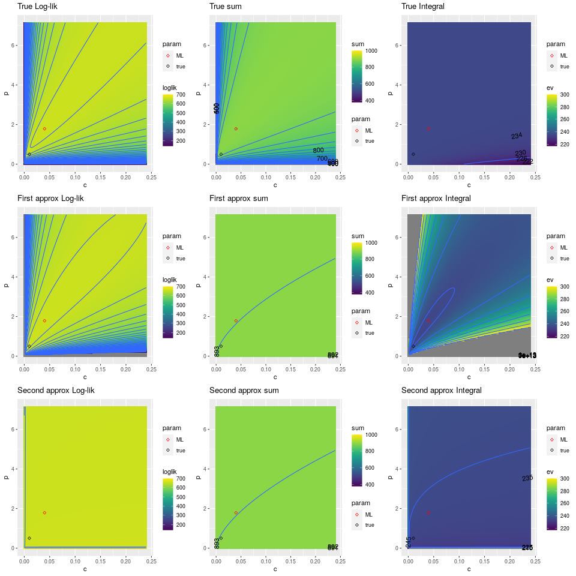
```


```{r}
# repeat in log-scale
lc <- seq(log(min(c.p.df$c)), log(max(c.p.df$c)), length.out = 100)
lp <- seq(log(min(c.p.df$p)), log(max(c.p.df$p)), length.out = 100)

c.p.df.log <- expand.grid(lc, lp)
colnames(c.p.df.log) <- c('log.c', 'log.pm1')


c.p.df.log$loglik <- sapply(1:nrow(c.p.df.log), 
                  function(x) 
                    hawkes.loglik(c(ML.est[1], 
                                    ML.est[2],
                                    exp(c.p.df.log$log.c[x]), 
                                    exp(c.p.df.log$log.pm1[x])), Tlim, ht$ts)) 

c.p.df.log$loglik.lin <- sapply(1:nrow(c.p.df.log), 
                  function(x) 
                    hawkes.loglik.lin(c(ML.est[1], 
                                    ML.est[2],
                                    exp(c.p.df.log$log.c[x]), 
                                    exp(c.p.df.log$log.pm1[x])), Tlim, ht$ts,
                                    log(ML.est))) 

c.p.df.log$loglik.lin2 <- sapply(1:nrow(c.p.df.log), 
                  function(x) 
                    hawkes.loglik.lin2(c(ML.est[1], 
                                    ML.est[2],
                                    exp(c.p.df.log$log.c[x]), 
                                    exp(c.p.df.log$log.pm1[x])), Tlim, ht$ts,
                                    log(ML.est))) 

c.p.df.log$ev <- sapply(1:nrow(c.p.df.log), 
                  function(x) 
                    exp.nev(c(ML.est[1], 
                              ML.est[2],
                              exp(c.p.df.log$log.c[x]), 
                              exp(c.p.df.log$log.pm1[x])), Tlim, ht$ts))

c.p.df.log$ev.lin <- sapply(1:nrow(c.p.df.log), 
                  function(x) 
                    exp.nev.lin(c(ML.est[1], 
                              ML.est[2],
                              exp(c.p.df.log$log.c[x]), 
                              exp(c.p.df.log$log.pm1[x])), Tlim, ht$ts,
                              log(ML.est)))

c.p.df.log$ev.lin2 <- sapply(1:nrow(c.p.df.log), 
                  function(x) 
                    exp.nev.lin2(c(ML.est[1], 
                              ML.est[2],
                              exp(c.p.df.log$log.c[x]), 
                              exp(c.p.df.log$log.pm1[x])), Tlim, ht$ts,
                              log(ML.est)))

save(mu.k.df.log, file = 'c.p.df.log.RData')
```


```{r}
#plotting
df.p.cp.log <- rbind(data.frame(x = log(true.parms[3]), y = log(true.parms[4]), 
                                 param = 'true'),
                  data.frame(x = log(ML.est[3]), y = log(ML.est[4]), param = 'ML'))


ll.lim <- range(c.p.df.log$loglik)
ll.lim <- c(0, 700)
ll.bk <- seq(ll.lim[1], ll.lim[2], length.out = 30)

pl.loglik.log <- 
  toplot.2D(x = c.p.df.log$log.c, y = c.p.df.log$log.pm1, z = c.p.df.log$loglik, 
            df.p = df.p.cp.log, zbreaks = ll.bk, zlim = ll.lim, 
            pl.title = 'True Log-lik', vlab = c('log(c)', 'log(p-1)', 'loglik'))

pl.loglik.lin.log <- 
  toplot.2D(x = c.p.df.log$log.c, y = c.p.df.log$log.pm1, z = c.p.df.log$loglik.lin, 
            df.p = df.p.cp.log, zbreaks = ll.bk, zlim = ll.lim, 
            pl.title = 'First approx Log-lik', vlab = c('log(c)', 'log(p-1)', 'loglik'))

pl.loglik.lin2.log <- 
  toplot.2D(x = c.p.df.log$log.c, y = c.p.df.log$log.pm1, z = c.p.df.log$loglik.lin2, 
            df.p = df.p.cp.log, zbreaks = ll.bk, zlim = ll.lim, 
            pl.title = 'Second approx Log-lik', vlab = c('log(c)', 'log(p-1)', 'loglik'))


ev.lim <- range(c.p.df.log$ev)
ev.lim <- c(200, 500)
ev.bk <- seq(ev.lim[1], ev.lim[2], length.out = 10)
  
pl.ev.log <- 
  toplot.2D(x = c.p.df.log$log.c, y = c.p.df.log$log.pm1, z = c.p.df.log$ev, 
            df.p = df.p.cp.log, zbreaks = ev.bk, zlim = ev.lim, 
            pl.title = 'True Integral', vlab = c('log(c)', 'log(p-1)', 'ev'))


pl.ev.lin.log <- 
  toplot.2D(x = c.p.df.log$log.c, y = c.p.df.log$log.pm1, z = c.p.df.log$ev.lin, 
            df.p = df.p.cp.log, zbreaks = ev.bk, zlim = ev.lim, 
            pl.title = 'First approx Integral', vlab = c('log(c)', 'log(p-1)', 'ev'))


pl.ev.lin2.log <- 
  toplot.2D(x = c.p.df.log$log.c, y = c.p.df.log$log.pm1, z = c.p.df.log$ev.lin2, 
            df.p = df.p.cp.log, zbreaks = ev.bk, zlim = ev.lim, 
            pl.title = 'Second approx Integral', vlab = c('log(c)', 'log(p-1)', 'ev'))

# summation component wrt mu and k
ss.lim <- range(c.p.df.log$loglik + c.p.df.log$ev)
ss.lim <- c(350,900)
ss.bk <- seq(ss.lim[1], ss.lim[2], length.out = 10)

pl.sum.log <- toplot.2D(x = c.p.df.log$log.c, y = c.p.df.log$log.pm1, 
                    z = c.p.df.log$loglik + c.p.df.log$ev, 
                       df.p = df.p.cp.log, zbreaks = ss.bk, zlim = ss.lim, 
                       pl.title = 'True sum', vlab = c('log(c)', 'log(p-1)', 'sum'))


pl.sum.lin.log <- toplot.2D(x = c.p.df.log$log.c, y = c.p.df.log$log.pm1, 
                    z = c.p.df.log$loglik.lin + c.p.df.log$ev.lin, 
                       df.p = df.p.cp.log, zbreaks = ss.bk, zlim = ss.lim, 
                       pl.title = 'First approx sum', vlab = c('log(c)', 'log(p-1)', 'sum'))


pl.sum.lin2.log <- toplot.2D(x = c.p.df.log$log.c, y = c.p.df.log$log.pm1, 
                    z = c.p.df.log$loglik.lin2 + c.p.df.log$ev.lin2, 
                       df.p = df.p.cp.log, zbreaks = ss.bk, zlim = ss.lim, 
                       pl.title = 'Second approx sum', vlab = c('log(c)', 'log(p-1)', 'sum'))

png('images/loglik.deco.comparison.logsc.cp.png', width = 480*2, height = 480*2)
multiplot(pl.loglik.log, pl.sum.log, pl.ev.log,
          pl.loglik.lin.log, pl.sum.lin.log, pl.ev.lin.log, 
          pl.loglik.lin2.log, pl.sum.lin2.log, pl.ev.lin2.log, 
          layout = matrix(1:9, byrow = T, ncol = 3))
dev.off()

```

```{r, eval = TRUE, out.width='100%', out.height='99%'}
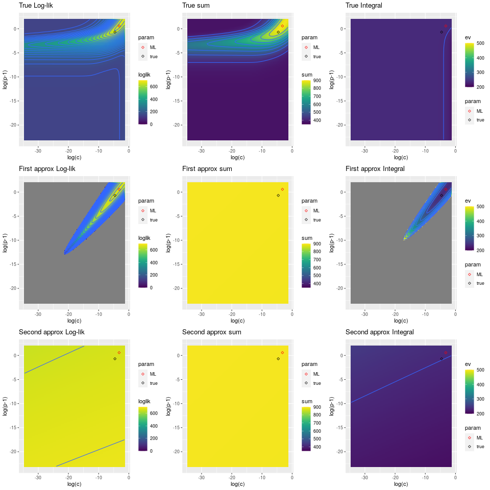
```


